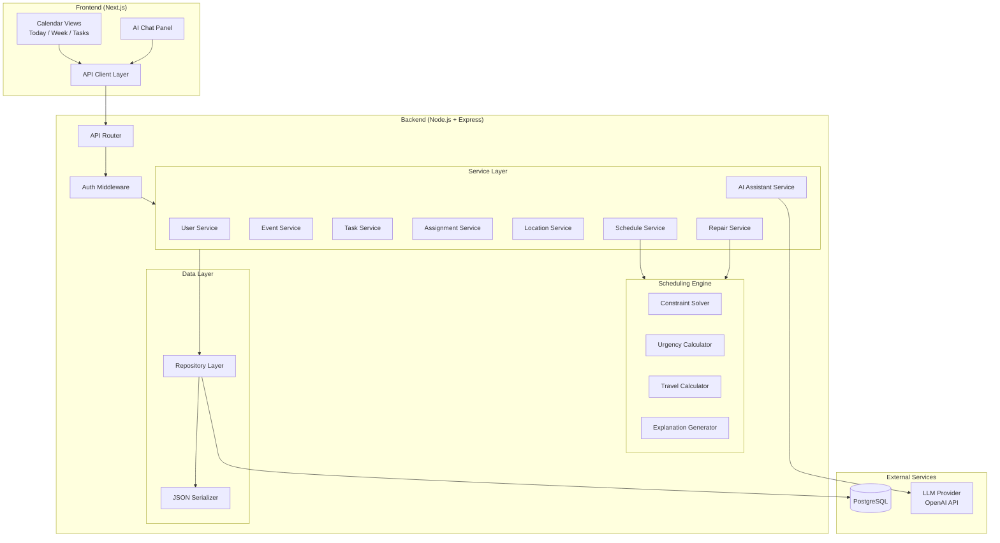
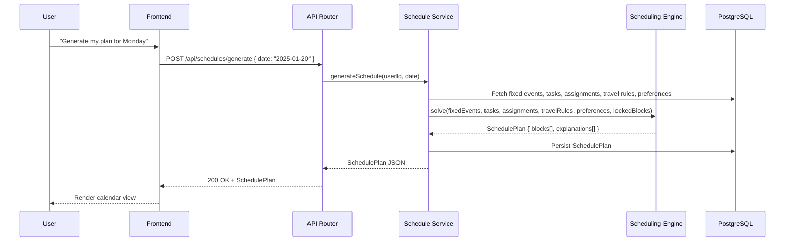
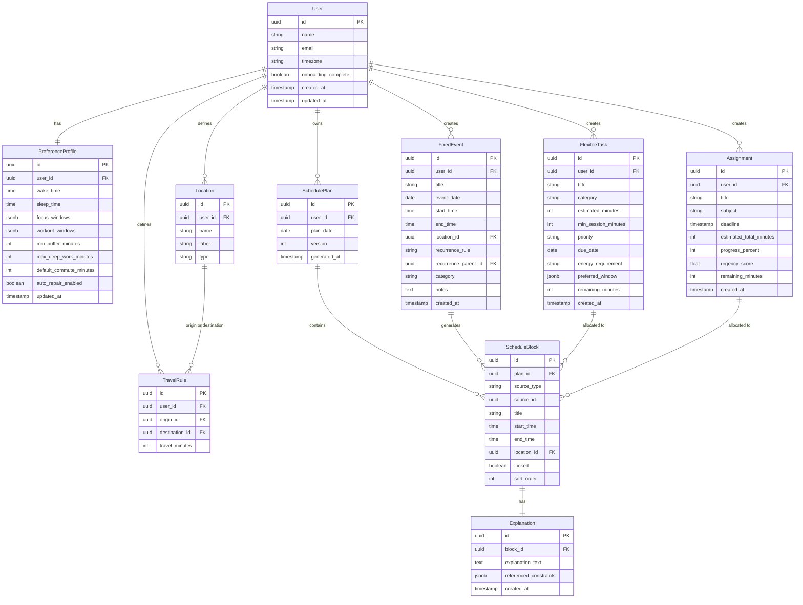

# Design Document: Cog Life Scheduler

## Overview

Cog (Chill Out Gang) is a single-user AI-assisted life scheduler that generates realistic daily and weekly plans. The system combines a deterministic constraint-based scheduling engine with an AI conversational layer. The scheduler places fixed commitments as immovable anchors, then fills remaining windows with flexible tasks and assignment work sessions, respecting travel times, sleep windows, and user preferences. An AI assistant provides natural language interaction for creating, editing, and explaining schedule items.

The system follows a clear separation: the scheduling engine is deterministic and constraint-driven (logic decides), while the AI layer handles natural language parsing and explanation generation (AI assists). This ensures reproducible, trustworthy schedules.

### Key Design Decisions

1. **Constraint solver over heuristic rules**: The scheduling engine uses a priority-based constraint solver that processes items in a defined optimization order rather than a general-purpose CSP solver. This keeps the engine fast, predictable, and debuggable while still respecting hard and soft constraints.
2. **Single-user architecture**: No multi-tenancy complexity. Each deployment serves one user with one preference profile.
3. **Explanation-first scheduling**: Every block placement records its reasoning at generation time, enabling cheap explanation retrieval without re-running the solver.
4. **Repair over regeneration**: Schedule changes trigger minimal repair rather than full regeneration, preserving user-approved arrangements and locked blocks.
5. **AI as translator, not decider**: The AI assistant converts natural language to structured API calls and rephrases explanations. It never overrides the scheduler's constraint logic.

## Architecture

### System Architecture Diagram



### Layer Responsibilities

- **Frontend**: React/Next.js SPA with Today, Week, and Task views plus an AI chat panel. Communicates exclusively through the REST API.
- **API Router**: Express router with authentication middleware. Validates request payloads, delegates to services, returns JSON responses.
- **Service Layer**: Business logic orchestration. Each service owns its domain entity lifecycle and delegates scheduling operations to the engine.
- **Scheduling Engine**: Pure, stateless constraint solver. Takes inputs (fixed events, flexible tasks, assignments, travel rules, preferences) and produces a Schedule_Plan with explanations. No database access — receives all data as function arguments.
- **Data Layer**: Repository pattern over PostgreSQL. Handles serialization/deserialization of domain objects to/from JSON and database rows.
- **AI Assistant Service**: Sends user messages to the LLM with a structured system prompt, parses the LLM response into operation intents, and delegates to the appropriate service.

### Request Flow



## Components and Interfaces

### Scheduling Engine

The engine is the core of the system — a pure function that takes all scheduling inputs and produces a plan.

```typescript
// Core engine interface
interface SchedulingEngine {
  solve(input: ScheduleInput): ScheduleResult;
  repair(existing: SchedulePlan, change: ScheduleChange, input: ScheduleInput): RepairResult;
}

interface ScheduleInput {
  date: string;                        // ISO date
  fixedEvents: FixedEvent[];
  flexibleTasks: FlexibleTask[];
  assignments: Assignment[];
  travelRules: TravelRule[];
  preferences: PreferenceProfile;
  lockedBlocks: ScheduleBlock[];
}

interface ScheduleResult {
  plan: SchedulePlan;
  unscheduledItems: UnscheduledItem[];
  explanations: Map<string, Explanation>; // blockId -> explanation
}

interface RepairResult extends ScheduleResult {
  changeSummary: ChangeSummary;
}

interface ChangeSummary {
  moved: { blockId: string; oldStart: string; newStart: string }[];
  added: string[];   // blockIds
  removed: string[]; // blockIds
}
```

#### Solver Algorithm

The solver operates in phases matching the optimization order:

1. **Phase 1 — Place Hard Constraints**: Insert all Fixed_Events and Locked_Blocks. These are immovable.
2. **Phase 2 — Compute Urgency**: Calculate Urgency_Score for all Assignments. Sort by urgency descending.
3. **Phase 3 — Place Deadline-Critical Items**: Allocate blocks for high-urgency assignments, working backward from deadlines.
4. **Phase 4 — Insert Travel Buffers**: For every pair of adjacent blocks at different locations, insert travel buffer blocks using Travel_Rules (or default commute time).
5. **Phase 5 — Apply Wellbeing Constraints**: Enforce sleep windows, maximum deep work block limits, and minimum buffer times.
6. **Phase 6 — Place Remaining Items**: Fill remaining gaps with flexible tasks and lower-urgency assignments, respecting preference windows (focus hours, workout windows) as soft constraints.
7. **Phase 7 — Generate Explanations**: For each placed block, record the constraints and preferences that influenced placement.

```typescript
// Urgency calculation
interface UrgencyCalculator {
  compute(assignment: Assignment, now: Date): number;
}

// urgencyScore = remainingMinutes / minutesUntilDeadline
// Clamped to [0, 1] range. Score of 1.0 means no slack remaining.

// Travel time lookup
interface TravelCalculator {
  getTravelTime(from: LocationId, to: LocationId, rules: TravelRule[], defaultMinutes: number): number;
}
```

### AI Assistant Service

```typescript
interface AIAssistantService {
  processMessage(userId: string, message: string): Promise<AIResponse>;
}

interface AIResponse {
  intent: 'create' | 'edit' | 'delete' | 'reschedule' | 'explain' | 'unknown';
  extractedFields?: Partial<FixedEvent | FlexibleTask | Assignment>;
  targetItemId?: string;
  proposedChanges?: ScheduleChange;
  followUpQuestion?: string;
  explanation?: string;
  confirmationRequired: boolean;
  summary: string;
}
```

The AI service sends the user message to the LLM with a system prompt containing:
- The user's current schedule context (today's blocks)
- Available operations and their required fields
- The user's timezone and current time
- Instructions to output structured JSON with the intent and extracted fields

### Service Layer Interfaces

```typescript
interface UserService {
  createUser(data: CreateUserInput): Promise<User>;
  getUser(userId: string): Promise<User>;
  updatePreferences(userId: string, prefs: Partial<PreferenceProfile>): Promise<PreferenceProfile>;
}

interface EventService {
  createFixedEvent(userId: string, data: CreateFixedEventInput): Promise<FixedEvent>;
  updateFixedEvent(eventId: string, data: Partial<FixedEvent>): Promise<FixedEvent>;
  updateRecurrenceInstance(eventId: string, instanceDate: string, data: Partial<FixedEvent>): Promise<FixedEvent>;
  deleteFixedEvent(eventId: string): Promise<void>;
  getFixedEventsForDate(userId: string, date: string): Promise<FixedEvent[]>;
  checkConflicts(userId: string, event: FixedEvent): Promise<ConflictWarning[]>;
}

interface TaskService {
  createFlexibleTask(userId: string, data: CreateFlexibleTaskInput): Promise<FlexibleTask>;
  updateFlexibleTask(taskId: string, data: Partial<FlexibleTask>): Promise<FlexibleTask>;
  deleteFlexibleTask(taskId: string): Promise<void>;
  getUnscheduledTasks(userId: string): Promise<FlexibleTask[]>;
}

interface AssignmentService {
  createAssignment(userId: string, data: CreateAssignmentInput): Promise<Assignment>;
  updateProgress(assignmentId: string, progressPercent: number): Promise<Assignment>;
  getAssignmentsWithUrgency(userId: string): Promise<Assignment[]>;
  getAtRiskAssignments(userId: string): Promise<AtRiskAssignment[]>;
}

interface LocationService {
  createLocation(userId: string, data: CreateLocationInput): Promise<Location>;
  createTravelRule(userId: string, data: CreateTravelRuleInput): Promise<TravelRule>;
  updateTravelRule(ruleId: string, travelMinutes: number): Promise<TravelRule>;
  getTravelRules(userId: string): Promise<TravelRule[]>;
}

interface ScheduleService {
  generateSchedule(userId: string, date: string): Promise<ScheduleResult>;
  repairSchedule(userId: string, planId: string, change: ScheduleChange): Promise<RepairResult>;
  lockBlock(blockId: string): Promise<ScheduleBlock>;
  unlockBlock(blockId: string): Promise<ScheduleBlock>;
  getSchedulePlan(userId: string, date: string): Promise<SchedulePlan>;
  getWeekPlan(userId: string, startDate: string): Promise<SchedulePlan[]>;
  getExplanation(blockId: string): Promise<Explanation>;
}
```

### Repository Layer

```typescript
interface Repository<T> {
  findById(id: string): Promise<T | null>;
  findMany(filter: Record<string, unknown>): Promise<T[]>;
  create(data: Omit<T, 'id'>): Promise<T>;
  update(id: string, data: Partial<T>): Promise<T>;
  delete(id: string): Promise<void>;
}
```

Each domain entity gets a typed repository: `UserRepository`, `FixedEventRepository`, `FlexibleTaskRepository`, `AssignmentRepository`, `LocationRepository`, `TravelRuleRepository`, `SchedulePlanRepository`, `ScheduleBlockRepository`, `ExplanationRepository`.


### API Endpoints

| Method | Path | Description | Service |
|--------|------|-------------|---------|
| POST | `/api/users` | Create user | UserService |
| GET | `/api/users/:id` | Get user | UserService |
| PUT | `/api/users/:id/preferences` | Update preferences | UserService |
| POST | `/api/fixed-events` | Create fixed event | EventService |
| GET | `/api/fixed-events?date=` | List fixed events for date | EventService |
| PUT | `/api/fixed-events/:id` | Update fixed event | EventService |
| PUT | `/api/fixed-events/:id/instances/:date` | Update single recurrence instance | EventService |
| DELETE | `/api/fixed-events/:id` | Delete fixed event | EventService |
| POST | `/api/flexible-tasks` | Create flexible task | TaskService |
| GET | `/api/flexible-tasks` | List unscheduled tasks | TaskService |
| PUT | `/api/flexible-tasks/:id` | Update flexible task | TaskService |
| DELETE | `/api/flexible-tasks/:id` | Delete flexible task | TaskService |
| POST | `/api/assignments` | Create assignment | AssignmentService |
| GET | `/api/assignments` | List assignments with urgency | AssignmentService |
| PUT | `/api/assignments/:id` | Update assignment | AssignmentService |
| PUT | `/api/assignments/:id/progress` | Update progress | AssignmentService |
| POST | `/api/locations` | Create location | LocationService |
| POST | `/api/travel-rules` | Create travel rule | LocationService |
| PUT | `/api/travel-rules/:id` | Update travel rule | LocationService |
| GET | `/api/travel-rules` | List travel rules | LocationService |
| POST | `/api/schedules/generate` | Generate schedule for date | ScheduleService |
| POST | `/api/schedules/:id/repair` | Repair existing schedule | ScheduleService |
| GET | `/api/schedules?date=` | Get schedule plan for date | ScheduleService |
| GET | `/api/schedules/week?start=` | Get week plan | ScheduleService |
| PUT | `/api/schedule-blocks/:id/lock` | Lock a block | ScheduleService |
| PUT | `/api/schedule-blocks/:id/unlock` | Unlock a block | ScheduleService |
| GET | `/api/schedule-blocks/:id/explanation` | Get block explanation | ScheduleService |
| POST | `/api/ai/message` | Send message to AI assistant | AIAssistantService |

### Frontend Application Structure

```
src/
├── app/                          # Next.js app router
│   ├── layout.tsx                # Root layout with sidebar nav
│   ├── page.tsx                  # Today view (default)
│   ├── week/page.tsx             # Week view
│   ├── tasks/page.tsx            # Task/Assignment list view
│   └── settings/page.tsx         # Preference profile settings
├── components/
│   ├── calendar/
│   │   ├── TodayView.tsx         # Chronological block list for one day
│   │   ├── WeekView.tsx          # 7-day grid view
│   │   ├── ScheduleBlock.tsx     # Single block card with lock icon, category color
│   │   ├── BlockDetail.tsx       # Detail panel with explanation
│   │   └── FreeTimeSlot.tsx      # Empty gap indicator
│   ├── chat/
│   │   ├── ChatPanel.tsx         # AI assistant chat interface
│   │   ├── MessageBubble.tsx     # Single message display
│   │   └── ConfirmationCard.tsx  # Proposed change confirmation UI
│   ├── tasks/
│   │   ├── TaskList.tsx          # Flexible task list
│   │   ├── AssignmentList.tsx    # Assignment list with urgency indicators
│   │   └── TaskForm.tsx          # Create/edit task form
│   ├── events/
│   │   ├── EventForm.tsx         # Create/edit fixed event form
│   │   └── RecurrenceSelector.tsx
│   └── settings/
│       ├── PreferenceForm.tsx    # Preference profile editor
│       └── LocationManager.tsx   # Location and travel rule management
├── hooks/
│   ├── useSchedule.ts           # Schedule data fetching and mutations
│   ├── useChat.ts               # AI chat state management
│   └── useAuth.ts               # Authentication state
├── lib/
│   ├── api.ts                   # API client functions
│   ├── types.ts                 # Shared TypeScript types
│   └── utils.ts                 # Date/time utilities
└── styles/
    └── globals.css              # Calm, minimal design tokens
```

## Data Models

### Entity Relationship Diagram



### Database Schema (PostgreSQL)

```sql
CREATE TABLE users (
    id UUID PRIMARY KEY DEFAULT gen_random_uuid(),
    name VARCHAR(255) NOT NULL,
    email VARCHAR(255) UNIQUE NOT NULL,
    timezone VARCHAR(50) NOT NULL DEFAULT 'UTC',
    onboarding_complete BOOLEAN NOT NULL DEFAULT false,
    created_at TIMESTAMPTZ NOT NULL DEFAULT now(),
    updated_at TIMESTAMPTZ NOT NULL DEFAULT now()
);

CREATE TABLE preference_profiles (
    id UUID PRIMARY KEY DEFAULT gen_random_uuid(),
    user_id UUID NOT NULL UNIQUE REFERENCES users(id) ON DELETE CASCADE,
    wake_time TIME NOT NULL DEFAULT '07:00',
    sleep_time TIME NOT NULL DEFAULT '23:00',
    focus_windows JSONB NOT NULL DEFAULT '[]',
    workout_windows JSONB NOT NULL DEFAULT '[]',
    min_buffer_minutes INT NOT NULL DEFAULT 5 CHECK (min_buffer_minutes >= 0),
    max_deep_work_minutes INT NOT NULL DEFAULT 90,
    default_commute_minutes INT NOT NULL DEFAULT 15,
    auto_repair_enabled BOOLEAN NOT NULL DEFAULT false,
    updated_at TIMESTAMPTZ NOT NULL DEFAULT now()
);

CREATE TABLE locations (
    id UUID PRIMARY KEY DEFAULT gen_random_uuid(),
    user_id UUID NOT NULL REFERENCES users(id) ON DELETE CASCADE,
    name VARCHAR(255) NOT NULL,
    label VARCHAR(100),
    type VARCHAR(50) NOT NULL
);

CREATE TABLE travel_rules (
    id UUID PRIMARY KEY DEFAULT gen_random_uuid(),
    user_id UUID NOT NULL REFERENCES users(id) ON DELETE CASCADE,
    origin_id UUID NOT NULL REFERENCES locations(id) ON DELETE CASCADE,
    destination_id UUID NOT NULL REFERENCES locations(id) ON DELETE CASCADE,
    travel_minutes INT NOT NULL CHECK (travel_minutes > 0),
    UNIQUE(origin_id, destination_id)
);

CREATE TABLE fixed_events (
    id UUID PRIMARY KEY DEFAULT gen_random_uuid(),
    user_id UUID NOT NULL REFERENCES users(id) ON DELETE CASCADE,
    title VARCHAR(255) NOT NULL,
    event_date DATE NOT NULL,
    start_time TIME NOT NULL,
    end_time TIME NOT NULL,
    location_id UUID REFERENCES locations(id) ON DELETE SET NULL,
    recurrence_rule VARCHAR(255),
    recurrence_parent_id UUID REFERENCES fixed_events(id) ON DELETE CASCADE,
    category VARCHAR(100),
    notes TEXT,
    created_at TIMESTAMPTZ NOT NULL DEFAULT now(),
    CHECK (end_time > start_time)
);

CREATE TABLE flexible_tasks (
    id UUID PRIMARY KEY DEFAULT gen_random_uuid(),
    user_id UUID NOT NULL REFERENCES users(id) ON DELETE CASCADE,
    title VARCHAR(255) NOT NULL,
    category VARCHAR(100),
    estimated_minutes INT NOT NULL CHECK (estimated_minutes > 0),
    min_session_minutes INT NOT NULL DEFAULT 15,
    priority VARCHAR(20) NOT NULL DEFAULT 'medium',
    due_date DATE,
    energy_requirement VARCHAR(20) DEFAULT 'medium',
    preferred_window JSONB,
    remaining_minutes INT NOT NULL,
    created_at TIMESTAMPTZ NOT NULL DEFAULT now(),
    CHECK (min_session_minutes <= estimated_minutes)
);

CREATE TABLE assignments (
    id UUID PRIMARY KEY DEFAULT gen_random_uuid(),
    user_id UUID NOT NULL REFERENCES users(id) ON DELETE CASCADE,
    title VARCHAR(255) NOT NULL,
    subject VARCHAR(255),
    deadline TIMESTAMPTZ NOT NULL,
    estimated_total_minutes INT NOT NULL CHECK (estimated_total_minutes > 0),
    progress_percent INT NOT NULL DEFAULT 0 CHECK (progress_percent >= 0 AND progress_percent <= 100),
    urgency_score FLOAT NOT NULL DEFAULT 0,
    remaining_minutes INT NOT NULL,
    created_at TIMESTAMPTZ NOT NULL DEFAULT now()
);

CREATE TABLE schedule_plans (
    id UUID PRIMARY KEY DEFAULT gen_random_uuid(),
    user_id UUID NOT NULL REFERENCES users(id) ON DELETE CASCADE,
    plan_date DATE NOT NULL,
    version INT NOT NULL DEFAULT 1,
    generated_at TIMESTAMPTZ NOT NULL DEFAULT now(),
    UNIQUE(user_id, plan_date, version)
);

CREATE TABLE schedule_blocks (
    id UUID PRIMARY KEY DEFAULT gen_random_uuid(),
    plan_id UUID NOT NULL REFERENCES schedule_plans(id) ON DELETE CASCADE,
    source_type VARCHAR(50) NOT NULL,
    source_id UUID,
    title VARCHAR(255) NOT NULL,
    start_time TIME NOT NULL,
    end_time TIME NOT NULL,
    location_id UUID REFERENCES locations(id) ON DELETE SET NULL,
    locked BOOLEAN NOT NULL DEFAULT false,
    sort_order INT NOT NULL,
    CHECK (end_time > start_time)
);

CREATE TABLE explanations (
    id UUID PRIMARY KEY DEFAULT gen_random_uuid(),
    block_id UUID NOT NULL UNIQUE REFERENCES schedule_blocks(id) ON DELETE CASCADE,
    explanation_text TEXT NOT NULL,
    referenced_constraints JSONB NOT NULL DEFAULT '[]',
    created_at TIMESTAMPTZ NOT NULL DEFAULT now()
);

-- Indexes
CREATE INDEX idx_fixed_events_user_date ON fixed_events(user_id, event_date);
CREATE INDEX idx_flexible_tasks_user ON flexible_tasks(user_id);
CREATE INDEX idx_assignments_user_deadline ON assignments(user_id, deadline);
CREATE INDEX idx_schedule_plans_user_date ON schedule_plans(user_id, plan_date);
CREATE INDEX idx_schedule_blocks_plan ON schedule_blocks(plan_id);
CREATE INDEX idx_travel_rules_user ON travel_rules(user_id);
```

### Domain Object Types (TypeScript)

```typescript
type Priority = 'low' | 'medium' | 'high' | 'critical';
type EnergyLevel = 'low' | 'medium' | 'high';
type SourceType = 'fixed_event' | 'flexible_task' | 'assignment' | 'travel_buffer';
type TimeWindow = { start: string; end: string }; // HH:mm format

interface User {
  id: string;
  name: string;
  email: string;
  timezone: string;
  onboardingComplete: boolean;
  createdAt: Date;
  updatedAt: Date;
}

interface PreferenceProfile {
  id: string;
  userId: string;
  wakeTime: string;       // HH:mm
  sleepTime: string;      // HH:mm
  focusWindows: TimeWindow[];
  workoutWindows: TimeWindow[];
  minBufferMinutes: number;
  maxDeepWorkMinutes: number;
  defaultCommuteMinutes: number;
  autoRepairEnabled: boolean;
  updatedAt: Date;
}

interface FixedEvent {
  id: string;
  userId: string;
  title: string;
  eventDate: string;      // YYYY-MM-DD
  startTime: string;      // HH:mm
  endTime: string;        // HH:mm
  locationId: string | null;
  recurrenceRule: string | null;
  recurrenceParentId: string | null;
  category: string;
  notes: string | null;
  createdAt: Date;
}

interface FlexibleTask {
  id: string;
  userId: string;
  title: string;
  category: string;
  estimatedMinutes: number;
  minSessionMinutes: number;
  priority: Priority;
  dueDate: string | null;  // YYYY-MM-DD
  energyRequirement: EnergyLevel;
  preferredWindow: TimeWindow | null;
  remainingMinutes: number;
  createdAt: Date;
}

interface Assignment {
  id: string;
  userId: string;
  title: string;
  subject: string;
  deadline: Date;
  estimatedTotalMinutes: number;
  progressPercent: number;
  urgencyScore: number;
  remainingMinutes: number;
  createdAt: Date;
}

interface Location {
  id: string;
  userId: string;
  name: string;
  label: string;
  type: string;
}

interface TravelRule {
  id: string;
  userId: string;
  originId: string;
  destinationId: string;
  travelMinutes: number;
}

interface SchedulePlan {
  id: string;
  userId: string;
  planDate: string;       // YYYY-MM-DD
  version: number;
  generatedAt: Date;
  blocks: ScheduleBlock[];
}

interface ScheduleBlock {
  id: string;
  planId: string;
  sourceType: SourceType;
  sourceId: string | null;
  title: string;
  startTime: string;      // HH:mm
  endTime: string;        // HH:mm
  locationId: string | null;
  locked: boolean;
  sortOrder: number;
}

interface Explanation {
  id: string;
  blockId: string;
  explanationText: string;
  referencedConstraints: string[];
  createdAt: Date;
}
```

## Correctness Properties

*A property is a characteristic or behavior that should hold true across all valid executions of a system — essentially, a formal statement about what the system should do. Properties serve as the bridge between human-readable specifications and machine-verifiable correctness guarantees.*

### Property 1: Wake/Sleep Time Validation

*For any* pair of wake time and sleep time values, the validation function SHALL accept the pair if and only if the wake time is logically before the sleep time within the same waking day, correctly handling overnight sleep patterns (e.g., wake 07:00, sleep 01:00 next day).

**Validates: Requirements 1.4**

### Property 2: Fixed Event Time Validation

*For any* pair of start time and end time for a Fixed_Event, the validation function SHALL accept the pair if and only if end time is strictly after start time.

**Validates: Requirements 2.2**

### Property 3: Fixed Event Overlap Detection

*For any* two Fixed_Events on the same date, the overlap detection function SHALL return a conflict if and only if their time ranges overlap (i.e., one starts before the other ends and vice versa).

**Validates: Requirements 2.3**

### Property 4: Recurrence Instance Generation

*For any* Fixed_Event with a valid recurrence rule and a planning horizon, the generated instances SHALL all match the recurrence pattern (correct day of week, correct interval) and fall within the planning horizon boundaries.

**Validates: Requirements 2.4**

### Property 5: Recurrence Instance Edit Isolation

*For any* recurring Fixed_Event and any single-instance edit, all instances other than the edited one SHALL remain identical to their state before the edit.

**Validates: Requirements 2.5**

### Property 6: Fixed Events Are Immovable Hard Constraints

*For any* set of Fixed_Events and any generated Schedule_Plan, every Fixed_Event SHALL appear in the plan at its exact specified start and end time, and no other Schedule_Block SHALL overlap with any Fixed_Event's time window.

**Validates: Requirements 2.7, 6.2**

### Property 7: Task Session/Duration Validation

*For any* Flexible_Task input, the validation function SHALL reject the task if and only if the minimum session length exceeds the estimated duration.

**Validates: Requirements 3.3**

### Property 8: Minimum Session Length Enforcement

*For any* Flexible_Task with a defined minimum session length and any generated Schedule_Plan, every Schedule_Block allocated to that task SHALL have a duration greater than or equal to the minimum session length.

**Validates: Requirements 3.4**

### Property 9: Task Splitting Preserves Total Duration

*For any* Flexible_Task that is split across multiple Schedule_Blocks in a generated plan, the sum of all block durations for that task SHALL equal the task's remaining duration.

**Validates: Requirements 3.5**

### Property 10: Urgency Score Computation

*For any* Assignment with known remaining minutes, total minutes, progress percentage, and time until deadline, the computed urgency score SHALL equal remainingMinutes / minutesUntilDeadline (clamped to [0, 1]), and updating the progress percentage SHALL correctly recalculate remaining minutes as totalMinutes × (1 − progressPercent / 100) and recompute the urgency score.

**Validates: Requirements 4.2, 4.6**

### Property 11: Urgency Score Monotonicity

*For any* Assignment with constant remaining work, computing the urgency score at two different times t1 and t2 where t1 < t2 (both before deadline) SHALL produce urgencyScore(t2) ≥ urgencyScore(t1).

**Validates: Requirements 4.3**

### Property 12: Urgency-Based Scheduling Priority

*For any* set of Assignments competing for limited available time in a Schedule_Plan, Assignments with higher urgency scores SHALL be allocated time blocks before Assignments with lower urgency scores.

**Validates: Requirements 4.4**

### Property 13: No Assignment Block After Deadline

*For any* Assignment and any generated Schedule_Plan, no Schedule_Block allocated to that Assignment SHALL have an end time after the Assignment's deadline.

**Validates: Requirements 4.5**

### Property 14: At-Risk Assignment Shortfall Reporting

*For any* Assignment where the total available scheduling time before the deadline is less than the remaining estimated work, the system SHALL report the Assignment as at-risk and the reported shortfall SHALL equal the remaining minutes minus the available schedulable minutes.

**Validates: Requirements 4.7**

### Property 15: Travel Buffer Enforcement

*For any* two adjacent Schedule_Blocks at different Locations in a generated plan, the gap between the end of the first block and the start of the second block SHALL be greater than or equal to the travel time defined by the applicable Travel_Rule (or the default commute time if no rule exists), and no block SHALL be placed at a location if the required travel time would cause it to start after its required start time.

**Validates: Requirements 5.3, 5.4, 5.5**

### Property 16: Schedule Blocks Are Chronologically Ordered

*For any* generated Schedule_Plan, the sequence of Schedule_Blocks SHALL be ordered such that for every consecutive pair of blocks, the first block's start time is less than or equal to the second block's start time.

**Validates: Requirements 6.1**

### Property 17: No Block in Sleep Window

*For any* generated Schedule_Plan and the user's Preference_Profile, no Schedule_Block SHALL overlap with the user's sleep window (from sleep time to wake time).

**Validates: Requirements 6.4**

### Property 18: Minimum Block Duration Enforcement

*For any* generated Schedule_Plan, every Schedule_Block that is not a travel buffer SHALL have a duration greater than or equal to the minimum buffer minutes defined in the user's Preference_Profile.

**Validates: Requirements 6.5**

### Property 19: Overloaded Schedule Reports Unscheduled Items

*For any* set of inputs where the total estimated duration of Flexible_Tasks and Assignments exceeds the available scheduling time, the scheduler SHALL report all items that could not be scheduled, and the scheduled items SHALL be ordered by priority (higher priority items scheduled before lower priority items).

**Validates: Requirements 6.6**

### Property 20: Every Block Has an Explanation

*For any* generated or repaired Schedule_Plan, every Schedule_Block in the plan SHALL have a corresponding Explanation record.

**Validates: Requirements 6.7, 9.1**

### Property 21: Locked Blocks Are Immovable

*For any* Schedule_Plan containing Locked_Blocks, after any schedule generation or Schedule_Repair operation, every Locked_Block SHALL remain at its exact original start time, end time, and position.

**Validates: Requirements 6.8, 7.3, 11.3**

### Property 22: Missed Task Reallocation

*For any* Flexible_Task marked as missed or incomplete with remaining duration > 0, the scheduler SHALL reallocate blocks totaling the remaining duration into available windows in the current or subsequent plans.

**Validates: Requirements 7.2**

### Property 23: Gap-First Insertion During Repair

*For any* Schedule_Plan with available gaps and a newly added Flexible_Task or Assignment that fits within those gaps, the repair operation SHALL insert the new item into gaps without displacing any existing unlocked blocks.

**Validates: Requirements 7.5**

### Property 24: Repair Change Summary Accuracy

*For any* Schedule_Repair operation, the reported change summary (moved, added, removed blocks) SHALL exactly match the actual differences between the previous and updated Schedule_Plans.

**Validates: Requirements 7.6**

### Property 25: Explanation Quality

*For any* generated Explanation, the explanation text SHALL reference at least one specific constraint or preference name (such as "Fixed_Event conflict", "Travel_Rule", or "Assignment deadline proximity"), and when a block is placed suboptimally due to constraint conflicts, the explanation SHALL identify the conflicting constraints and the tradeoffs made.

**Validates: Requirements 9.3, 9.5**

### Property 26: Schedule Plan Serialization Round Trip

*For any* valid Schedule_Plan object, serializing it to JSON and then deserializing the JSON back to a Schedule_Plan object SHALL produce an object deeply equal to the original.

**Validates: Requirements 12.1, 12.2, 12.3**

### Property 27: Invalid API Input Returns 400

*For any* API endpoint and any request payload with missing required fields or fields of incorrect type, the API SHALL return an HTTP 400 response with a descriptive error message identifying the invalid fields.

**Validates: Requirements 13.6**


## Error Handling

### Validation Errors

All input validation happens at the service layer before any database writes or engine invocations.

| Error Condition | HTTP Status | Error Code | Description |
|----------------|-------------|------------|-------------|
| Missing required field | 400 | `VALIDATION_ERROR` | Identifies the missing field(s) |
| Invalid time range (end ≤ start) | 400 | `INVALID_TIME_RANGE` | Specifies which entity and which times |
| Wake time not before sleep time | 400 | `INVALID_SLEEP_SCHEDULE` | Explains the logical day constraint |
| Negative buffer minutes | 400 | `INVALID_BUFFER` | Min buffer must be ≥ 0 |
| Min session > estimated duration | 400 | `INVALID_SESSION_LENGTH` | Min session cannot exceed total duration |
| Zero or negative duration | 400 | `INVALID_DURATION` | Duration must be > 0 |
| Due date in the past | 400 | `PAST_DUE_DATE` | Due date must be in the future |
| Progress outside 0-100 range | 400 | `INVALID_PROGRESS` | Progress must be between 0 and 100 |
| Resource not found | 404 | `NOT_FOUND` | Identifies the resource type and ID |
| Unauthenticated request | 401 | `UNAUTHORIZED` | Authentication required |

### Scheduling Engine Errors

The scheduling engine is a pure function and does not throw exceptions for normal constraint conflicts. Instead, it returns structured results:

- **Unscheduled items**: When items cannot fit, they are returned in `ScheduleResult.unscheduledItems` with reasons.
- **At-risk assignments**: When an assignment cannot be fully scheduled before its deadline, the result includes the shortfall in minutes.
- **Conflict warnings**: When a new Fixed_Event overlaps an existing one, the service returns a `ConflictWarning[]` without blocking the save.

### Database Errors

- All multi-table writes use database transactions. If any write fails, the entire transaction rolls back.
- Failed writes return a `DATABASE_ERROR` with a descriptive message. No partial data is committed.
- Connection failures trigger retries (up to 3 attempts with exponential backoff) before returning a `SERVICE_UNAVAILABLE` error.

### AI Assistant Errors

- **LLM timeout/failure**: Return a user-friendly message ("I'm having trouble processing that right now. Please try again.") with a `503` status.
- **Unparseable LLM response**: Fall back to asking the user to rephrase, log the raw response for debugging.
- **Missing fields in extracted intent**: The AI assistant asks a targeted follow-up question for only the missing fields rather than failing.

### Error Response Format

```json
{
  "error": {
    "code": "VALIDATION_ERROR",
    "message": "Human-readable description of the error",
    "details": {
      "field": "minBufferMinutes",
      "reason": "Must be greater than or equal to 0",
      "value": -5
    }
  }
}
```

## Testing Strategy

### Dual Testing Approach

The testing strategy combines property-based tests for universal correctness guarantees with example-based tests for specific scenarios, edge cases, and integration points.

### Property-Based Tests

Property-based tests validate the 27 correctness properties defined above. Each property test generates random valid inputs and verifies the property holds across all of them.

**Library**: [fast-check](https://github.com/dubzzz/fast-check) (TypeScript property-based testing library)

**Configuration**:
- Minimum 100 iterations per property test
- Each test tagged with: `Feature: cog-life-scheduler, Property {number}: {title}`
- Custom arbitraries (generators) for domain objects: `FixedEvent`, `FlexibleTask`, `Assignment`, `SchedulePlan`, `PreferenceProfile`, `TravelRule`, `Location`

**Property test groupings**:

1. **Validation properties** (Properties 1, 2, 3, 7): Test input validation functions in isolation with generated time pairs, event pairs, and task configurations.
2. **Urgency computation properties** (Properties 10, 11): Test the urgency calculator with generated assignments at varying times and progress levels.
3. **Scheduler invariant properties** (Properties 6, 8, 9, 12, 13, 15, 16, 17, 18, 19, 20, 21): Test the scheduling engine's `solve()` function with generated inputs, verifying all invariants hold on the output.
4. **Repair properties** (Properties 21, 22, 23, 24): Test the `repair()` function with generated existing plans and changes, verifying locked block preservation, reallocation, gap-first insertion, and change summary accuracy.
5. **Recurrence properties** (Properties 4, 5): Test recurrence expansion and instance edit isolation with generated recurrence rules.
6. **Serialization properties** (Property 26): Test JSON round-trip with generated `SchedulePlan` objects.
7. **API validation properties** (Property 27): Test API input validation with generated invalid payloads.
8. **Explanation properties** (Properties 20, 25): Test that generated explanations exist for all blocks and reference specific constraints.

### Example-Based Unit Tests

Example-based tests cover specific scenarios, edge cases, and behaviors not suited for property testing:

- **CRUD operations**: Verify entity creation stores all required fields (Requirements 1.1, 1.2, 2.1, 3.1, 4.1, 5.1, 5.2)
- **Edge cases**: Zero duration tasks, negative buffer values, past due dates (Requirements 1.5, 3.2, 3.7)
- **UI behavior**: Today view rendering, Week view rendering, block detail panel, lock indicators (Requirements 10.1–10.6, 11.1, 11.2, 11.4, 11.5)
- **AI assistant flows**: Follow-up questions for missing fields, confirmation before changes, unsupported operation handling (Requirements 8.5, 8.6, 8.7)
- **Explanation retrieval**: Verify explanation display for a specific block (Requirement 9.2)
- **Lock/unlock**: Verify state toggle and persistence (Requirements 11.1, 11.2)
- **Repair confirmation**: Verify changes are not applied without user confirmation (Requirement 7.7)
- **404 and 401 responses**: Verify correct HTTP status for missing resources and unauthenticated requests (Requirements 13.7, 13.8)

### Integration Tests

Integration tests verify end-to-end flows and external service interactions:

- **Database persistence**: All entity types can be persisted and retrieved without data loss (Requirement 12.4)
- **Transaction rollback**: Failed writes do not leave partial data (Requirement 12.5)
- **Preference propagation**: Updated preferences are used in subsequent schedule generation (Requirement 1.3)
- **Priority propagation**: Updated task priorities affect scheduling (Requirement 3.6)
- **Travel rule updates**: Updated travel times are used in subsequent scheduling (Requirement 5.6)
- **Event deletion cascade**: Deleting a Fixed_Event removes associated schedule blocks (Requirement 2.6)
- **Repair triggering**: Event changes trigger schedule repair (Requirement 7.1)
- **Minimal disruption**: Repair changes fewer blocks than full regeneration (Requirement 7.4)
- **AI assistant flows**: End-to-end message processing with mock LLM (Requirements 8.1–8.4, 8.8)
- **Explanation rephrasing**: AI rephrasing preserves factual content (Requirement 9.4)
- **View update latency**: Views update within 2 seconds of schedule changes (Requirement 10.5)

### Smoke Tests

Smoke tests verify API endpoint existence and basic authentication:

- All CRUD endpoints respond to valid requests (Requirement 13.1)
- Schedule generation endpoint exists (Requirement 13.2)
- Schedule repair endpoint exists (Requirement 13.3)
- AI message endpoint exists (Requirement 13.4)
- Explanation retrieval endpoint exists (Requirement 13.5)

### Test Organization

```
tests/
├── properties/                    # Property-based tests (fast-check)
│   ├── generators/                # Custom arbitraries for domain objects
│   │   ├── fixedEvent.gen.ts
│   │   ├── flexibleTask.gen.ts
│   │   ├── assignment.gen.ts
│   │   ├── schedulePlan.gen.ts
│   │   ├── preferenceProfile.gen.ts
│   │   └── travelRule.gen.ts
│   ├── validation.prop.ts         # Properties 1, 2, 3, 7
│   ├── urgency.prop.ts            # Properties 10, 11
│   ├── scheduler.prop.ts          # Properties 6, 8, 9, 12, 13, 15, 16, 17, 18, 19
│   ├── repair.prop.ts             # Properties 21, 22, 23, 24
│   ├── recurrence.prop.ts         # Properties 4, 5
│   ├── serialization.prop.ts      # Property 26
│   ├── explanation.prop.ts        # Properties 20, 25
│   └── api-validation.prop.ts     # Property 27
├── unit/                          # Example-based unit tests
│   ├── services/
│   ├── engine/
│   └── validation/
├── integration/                   # Integration tests
│   ├── database/
│   ├── api/
│   └── ai-assistant/
└── smoke/                         # Smoke tests
    └── api-endpoints.smoke.ts
```
