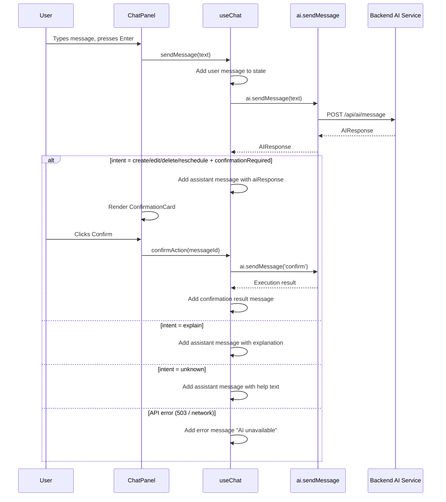

# Design Document: Functional Frontend

## Overview

The Cog Life Scheduler frontend has a polished UI with all visual components built, but the interactive CRUD flows are disconnected. The backend API is fully operational with typed endpoints for fixed events, flexible tasks, assignments, schedule generation, AI chat, and settings. The frontend API client (`frontend/src/lib/api.ts`) has all typed functions ready, and hooks (`useSchedule`, `useChat`, `useToast`) are built.

This design covers wiring the existing UI components to the backend API to make the application fully functional. The work spans seven areas: (1) item creation via modal forms, (2) item editing and deletion, (3) schedule generation flow, (4) AI chatbot integration, (5) schedule block interactions, (6) settings persistence, and (7) data refresh after mutations.

No new npm dependencies are required. All changes are within the existing Next.js 15 / React 19 / plain CSS stack.

### Key Design Decisions

1. **Modal overlay pattern for creation forms**: EventForm and TaskForm already exist as standalone components. Rather than adding inline forms to each page, a shared `Modal` component wraps them in an overlay triggered by "+" buttons. This keeps page components clean and reuses existing form logic.
2. **Callback-based data refresh over global state**: Each page owns its data via local state + fetch functions. After a mutation (create/edit/delete), the relevant page's `fetchData` or `refresh` callback is invoked. This avoids introducing a global state library.
3. **Graceful AI degradation**: The AI chatbot depends on OPENAI_API_KEY. When the backend returns a 503 or connection error, the chat panel shows a friendly "AI unavailable" message rather than crashing.
4. **Optimistic lock/unlock toggle**: The BlockDetail lock toggle calls the API and updates local state immediately for responsive UX, with error rollback if the API call fails.
5. **Confirmation-before-action for AI chat**: When the AI returns `confirmationRequired: true`, the ConfirmationCard is shown. On confirm, a follow-up "confirm" message is sent. On reject, the action is cancelled locally.

## Architecture

### Interaction Flow Overview

```mermaid
graph TB
    subgraph Pages["Page Views"]
        Today[Today Page]
        Week[Week Page]
        Tasks[Tasks Page]
        Settings[Settings Page]
    end

    subgraph Modals["Modal Overlays"]
        EM[EventForm Modal]
        TM[TaskForm Modal]
    end

    subgraph Panels["Side Panels"]
        BD[BlockDetail Panel]
        CP[ChatPanel]
    end

    subgraph Hooks["Data Hooks"]
        US[useSchedule]
        UC[useChat]
        UT[useToast]
    end

    subgraph API["API Client (api.ts)"]
        FE_API[fixedEvents]
        FT_API[flexibleTasks]
        AS_API[assignments]
        SC_API[schedules]
        SB_API[scheduleBlocks]
        AI_API[ai]
        USR_API[users / locations / travelRules]
    end

    Today -->|"+ button"| EM
    Today -->|"+ button"| TM
    Today -->|"click block"| BD
    Today -->|"Generate Plan"| US
    Week -->|"+ button"| EM
    Week -->|"click block"| BD
    Tasks -->|"+ button"| TM
    Tasks -->|"edit/delete"| FT_API
    Tasks -->|"edit/delete"| AS_API
    Settings --> USR_API

    EM --> FE_API
    TM --> FT_API
    TM --> AS_API
    BD --> SB_API
    CP --> UC
    UC --> AI_API
    US --> SC_API

    FE_API -->|"onSaved"| Today
    FT_API -->|"onSaved"| Tasks
    AS_API -->|"onSaved"| Tasks
    SC_API -->|"result"| Today


### Data Mutation & Refresh Flow

```mermaid
sequenceDiagram
    participant U as User
    participant Page as Page Component
    participant Modal as Modal + Form
    participant API as API Client
    participant Toast as Toast System

    U->>Page: Clicks "+" button
    Page->>Modal: Opens modal (setShowModal(true))
    U->>Modal: Fills form, clicks Save
    Modal->>API: create/update call
    API-->>Modal: Success response
    Modal->>Toast: addToast('success', 'Item created')
    Modal->>Page: onSaved() callback
    Page->>Page: fetchData() re-fetches list
    Page->>Modal: Closes modal (setShowModal(false))
```

### AI Chat Interaction Flow



## Components and Interfaces

### New Component: Modal

A lightweight overlay wrapper for forms. No new dependencies — pure CSS + React portal.

```typescript
// components/ui/Modal.tsx
interface ModalProps {
  open: boolean;
  onClose: () => void;
  children: React.ReactNode;
  ariaLabel: string;
}

// Renders a backdrop overlay + centered content card
// Closes on backdrop click and Escape key
// Traps focus within the modal for accessibility
// Uses slideUp + fadeIn CSS animation on open
```

### Modified Component: Today Page (page.tsx)

```typescript
// Additions to existing TodayPage:
// - State: showEventModal, showTaskModal
// - "+" FAB or header buttons to open EventForm / TaskForm in Modal
// - onSaved callback from forms triggers useSchedule.refresh()
// - Generate Plan button already works (wired in existing code)
// - Lock/unlock toggle on BlockDetail already wired via handleLockToggle
```

### Modified Component: Week Page (week/page.tsx)

```typescript
// Additions to existing WeekPage:
// - State: showEventModal
// - "+" button in header to open EventForm in Modal
// - onSaved callback triggers useWeekSchedule.refresh()
// - Block click → BlockDetail already works
// - Add onLockToggle to BlockDetail (currently missing)
```

### Modified Component: Tasks Page (tasks/page.tsx)

```typescript
// Additions to existing TasksPage:
// - State: showTaskModal, editingTask, editingAssignment, deleteConfirm
// - "+" button in header to open TaskForm in Modal
// - Edit button on each task/assignment card → opens TaskForm with initial data
// - Delete button on each task/assignment card → confirmation → API delete → refresh
// - onSaved callback triggers fetchData()
```

### Modified Component: ChatPanel

```typescript
// The ChatPanel is already mostly wired. Additions:
// - Handle AI unavailable (503/network error) with friendly message
// - After successful create/edit/delete confirmation, emit a callback
//   so parent can refresh schedule data
// - Add onDataChanged prop to ChatPanel for triggering page refreshes
```

### Modified Component: BlockDetail

```typescript
// Already wired for explanation loading and lock toggle.
// Additions:
// - Ensure onLockToggle is passed from WeekPage (currently only TodayPage passes it)
// - Error handling with toast on lock/unlock failure
```

### Modified Component: Settings Page

```typescript
// PreferenceForm already calls users.updatePreferences and shows toast via onSaved
// LocationManager already calls locations.create and travelRules.create
// Additions:
// - LocationManager: add success toasts after create operations
// - LocationManager: show toast on error instead of inline-only error
```

## Data Models

No new data models are introduced. All types are already defined in `frontend/src/lib/types.ts`:

- `FixedEvent`, `FlexibleTask`, `Assignment` — entity types for CRUD
- `SchedulePlan`, `ScheduleBlock`, `Explanation` — schedule types
- `AIResponse` — chat response type with intent, confirmationRequired, summary
- `UnscheduledItem`, `AtRiskAssignment`, `ChangeSummary` — schedule result types

All API input types are defined in `frontend/src/lib/api.ts`:

- `CreateFixedEventInput`, `CreateFlexibleTaskInput`, `CreateAssignmentInput`
- `UpdatePreferencesInput`, `CreateLocationInput`, `CreateTravelRuleInput`

## Key Functions with Formal Specifications

### Function: openCreateModal

```typescript
function openCreateModal(type: 'event' | 'task' | 'assignment'): void
```

**Preconditions:**
- Page component is mounted and interactive
- No other modal is currently open

**Postconditions:**
- The appropriate modal state is set to `true`
- The form renders with empty initial values
- Focus moves to the first form field

### Function: handleFormSaved (per page)

```typescript
async function handleFormSaved(): Promise<void>
```

**Preconditions:**
- A create or update API call has succeeded
- The modal is currently open

**Postconditions:**
- The modal is closed (`setShowModal(false)`)
- The page's data is re-fetched (tasks list, schedule, etc.)
- A success toast is displayed

### Function: handleDelete (Tasks page)

```typescript
async function handleDelete(type: 'task' | 'assignment', id: string): Promise<void>
```

**Preconditions:**
- `id` is a valid UUID of an existing entity
- User has confirmed the deletion

**Postconditions:**
- The entity is deleted via API (`flexibleTasks.delete` or `assignments.update`)
- The tasks list is re-fetched
- A success toast is displayed
- If API fails, an error toast is displayed and the list is unchanged

### Function: handleLockToggle

```typescript
async function handleLockToggle(blockId: string, currentlyLocked: boolean): Promise<void>
```

**Preconditions:**
- `blockId` is a valid UUID of an existing schedule block
- The block detail panel is open showing this block

**Postconditions:**
- If `currentlyLocked` is true, `scheduleBlocks.unlock(blockId)` is called
- If `currentlyLocked` is false, `scheduleBlocks.lock(blockId)` is called
- Local state is updated to reflect the new lock status
- If API fails, local state is rolled back and error toast is shown

### Function: handleChatConfirm

```typescript
async function handleChatConfirm(messageId: string): Promise<void>
```

**Preconditions:**
- The message with `messageId` has `aiResponse.confirmationRequired === true`
- The user clicked "Confirm" on the ConfirmationCard

**Postconditions:**
- A "confirm" message is sent to the AI backend
- The AI response (execution result) is added to the message list
- If the confirmed action was create/edit/delete, a data refresh callback is triggered

## Algorithmic Pseudocode

### Modal Open/Close Lifecycle

```typescript
// State management for modal in any page
const [modalOpen, setModalOpen] = useState(false);
const [modalType, setModalType] = useState<'event' | 'task' | null>(null);
const [editingItem, setEditingItem] = useState<FixedEvent | FlexibleTask | Assignment | null>(null);

function openCreate(type: 'event' | 'task') {
  setEditingItem(null);
  setModalType(type);
  setModalOpen(true);
}

function openEdit(item: FixedEvent | FlexibleTask | Assignment, type: 'event' | 'task') {
  setEditingItem(item);
  setModalType(type);
  setModalOpen(true);
}

function handleSaved() {
  setModalOpen(false);
  setEditingItem(null);
  fetchData(); // re-fetch page data
}

function handleCancel() {
  setModalOpen(false);
  setEditingItem(null);
}
```

### Delete with Confirmation

```typescript
const [deleteTarget, setDeleteTarget] = useState<{ type: 'task' | 'assignment'; id: string } | null>(null);

async function confirmDelete() {
  if (!deleteTarget) return;
  try {
    if (deleteTarget.type === 'task') {
      await flexibleTasks.delete(deleteTarget.id);
    } else {
      // Assignments don't have a delete endpoint in the current API
      // Use update with appropriate status or handle accordingly
    }
    addToast('success', `${deleteTarget.type === 'task' ? 'Task' : 'Assignment'} deleted`);
    setDeleteTarget(null);
    fetchData();
  } catch (err) {
    addToast('error', err instanceof Error ? err.message : 'Delete failed');
  }
}
```

### AI Chat with Graceful Degradation

```typescript
// In useChat hook — enhanced error handling
const sendMessage = useCallback(async (text: string) => {
  const userMsg = createUserMessage(text);
  setMessages(prev => [...prev, userMsg]);
  setSending(true);

  try {
    const response = await ai.sendMessage(text);
    const assistantMsg = createAssistantMessage(response);
    setMessages(prev => [...prev, assistantMsg]);
  } catch (err: unknown) {
    const isUnavailable = err instanceof ApiRequestError && 
      (err.status === 503 || err.status === 500);
    
    const errorText = isUnavailable
      ? 'The AI assistant is currently unavailable. Please check that OPENAI_API_KEY is configured.'
      : `Sorry, something went wrong: ${err instanceof Error ? err.message : 'Unknown error'}`;
    
    const errorMsg = createAssistantMessage({ summary: errorText } as AIResponse);
    setMessages(prev => [...prev, errorMsg]);
  } finally {
    setSending(false);
  }
}, []);
```

### Schedule Generation with Full UX

```typescript
// Already implemented in TodayPage — the flow is:
// 1. User clicks "Generate Plan"
// 2. Button shows spinner (generating state from useSchedule)
// 3. useSchedule.generateSchedule() calls POST /api/schedules/generate
// 4. On success: blocks render with staggered animation, toast shown
// 5. On error: error toast shown, button re-enabled
// 6. Unscheduled items and at-risk assignments render in warning sections

// The existing implementation is correct. No changes needed to the generation flow itself.
// The only gap is ensuring the "Generate Plan" button is visible and accessible.
```

## Example Usage

### Creating a Fixed Event from Today Page

```typescript
// In TodayPage component:
const [showEventModal, setShowEventModal] = useState(false);

// In JSX — add button next to "Generate Plan":
<button className="btn btn--secondary" onClick={() => setShowEventModal(true)}>
  + Add Event
</button>

// Modal with EventForm:
<Modal open={showEventModal} onClose={() => setShowEventModal(false)} ariaLabel="Create event">
  <EventForm
    onSaved={() => { setShowEventModal(false); refresh(); }}
    onCancel={() => setShowEventModal(false)}
  />
</Modal>
```

### Editing a Task from Tasks Page

```typescript
// In TasksPage — add edit button to task card:
<button
  className="btn btn--secondary btn--sm"
  onClick={() => { setEditingTask(task); setShowTaskModal(true); }}
>
  Edit
</button>

// Modal with TaskForm pre-filled:
<Modal open={showTaskModal} onClose={() => setShowTaskModal(false)} ariaLabel="Edit task">
  <TaskForm
    mode="task"
    initialTask={editingTask}
    onSaved={() => { setShowTaskModal(false); setEditingTask(null); fetchData(); }}
    onCancel={() => { setShowTaskModal(false); setEditingTask(null); }}
  />
</Modal>
```

### AI Chat Creating an Event

```typescript
// User types: "Create a gym session tomorrow at 6 PM"
// AI returns: { intent: 'create', confirmationRequired: true, summary: 'Create "Gym Session" tomorrow 6-7 PM' }
// ChatPanel renders ConfirmationCard with Confirm/Cancel
// User clicks Confirm → useChat.confirmAction() → sends "confirm" to AI
// AI executes creation, returns success summary
// ChatPanel shows success message
// Parent page refreshes schedule data via onDataChanged callback
```

## Correctness Properties

### Property 1: Modal Exclusivity

*For any* page component at any point in time, at most one modal SHALL be open. Opening a new modal SHALL close any previously open modal.

### Property 2: Data Refresh After Mutation

*For any* successful create, update, or delete API call triggered from a form or action button, the page's data list SHALL be re-fetched within the same event cycle, ensuring the UI reflects the latest server state.

### Property 3: Form Reset on Modal Close

*For any* modal that is closed (via cancel, backdrop click, or Escape key), the editing state SHALL be reset to null, and reopening the modal SHALL show a clean empty form (for create) or fresh data (for edit).

### Property 4: Delete Requires Confirmation

*For any* delete action on a task or assignment, the system SHALL display a confirmation prompt before calling the delete API. The entity SHALL not be deleted if the user cancels the confirmation.

### Property 5: AI Unavailable Graceful Degradation

*For any* AI message send that results in a 503, 500, or network error, the chat panel SHALL display a user-friendly error message and SHALL NOT crash or become unresponsive. The user SHALL be able to continue sending messages.

### Property 6: Lock Toggle Consistency

*For any* lock/unlock toggle action on a schedule block, the UI lock state SHALL match the server state after the API call completes. If the API call fails, the UI SHALL revert to the previous lock state.

### Property 7: Toast Feedback for All Mutations

*For any* create, update, or delete operation (events, tasks, assignments, preferences, locations), a success toast SHALL be displayed on success and an error toast SHALL be displayed on failure.

## Error Handling

### Error Scenario 1: API Request Failure (Network)

**Condition**: Network is unavailable or backend is down
**Response**: API client throws an Error. The calling component catches it and displays an error toast with the message.
**Recovery**: User can retry the action. No partial state is left.

### Error Scenario 2: Validation Error (400)

**Condition**: Backend returns HTTP 400 with field-level validation errors
**Response**: `ApiRequestError` is thrown with `status: 400` and `body.error.details`. Forms display inline errors below invalid fields.
**Recovery**: User corrects the fields and resubmits.

### Error Scenario 3: AI Service Unavailable (503)

**Condition**: OPENAI_API_KEY is not configured or OpenAI API is down
**Response**: Chat hook catches the error and adds a friendly "AI unavailable" message to the chat. No crash.
**Recovery**: User can continue using the app. AI chat shows the error but remains interactive.

### Error Scenario 4: Lock/Unlock Failure

**Condition**: Schedule block lock/unlock API call fails (e.g., block no longer exists)
**Response**: UI reverts the lock toggle to its previous state. Error toast is shown.
**Recovery**: User can refresh the schedule to get the latest state.

### Error Scenario 5: Schedule Generation Failure

**Condition**: No events/tasks exist, or engine encounters an error
**Response**: Generate button re-enables, error toast is shown with the error message.
**Recovery**: User can add items and retry generation.

## Testing Strategy

### Unit Testing Approach

- Test Modal component: open/close state, Escape key handling, backdrop click
- Test form submission flows: mock API calls, verify toast triggers and callback invocations
- Test delete confirmation flow: verify API is only called after confirmation
- Test AI error handling: mock 503 responses, verify graceful degradation message

### Integration Testing Approach

- Test full create flow: open modal → fill form → submit → verify API called → verify list refreshed
- Test edit flow: click edit → verify form pre-filled → submit → verify API called with correct ID
- Test schedule generation: click Generate → verify loading state → verify blocks render
- Test chat flow: send message → verify response rendered → confirm action → verify execution

## Dependencies

No new npm dependencies. All functionality uses:
- `react` (useState, useCallback, useEffect, useRef)
- `next/navigation` (usePathname)
- Existing API client (`frontend/src/lib/api.ts`)
- Existing hooks (`useSchedule`, `useChat`, `useToast`)
- Existing form components (`EventForm`, `TaskForm`, `PreferenceForm`)
- Existing UI components (`Toast`, `ToastProvider`, `LoadingSkeleton`)
