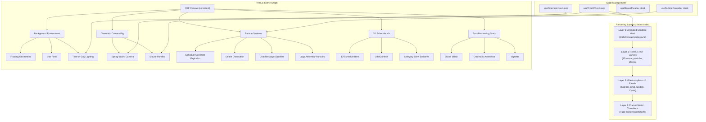
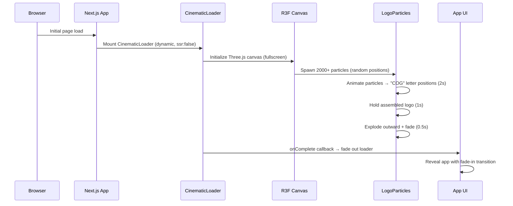
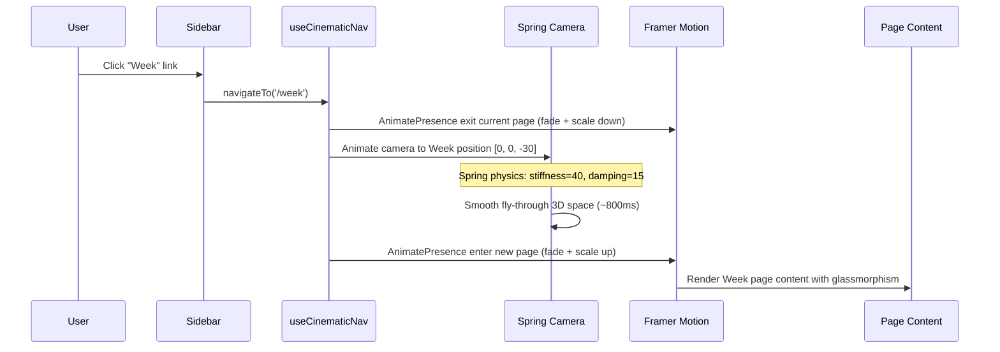
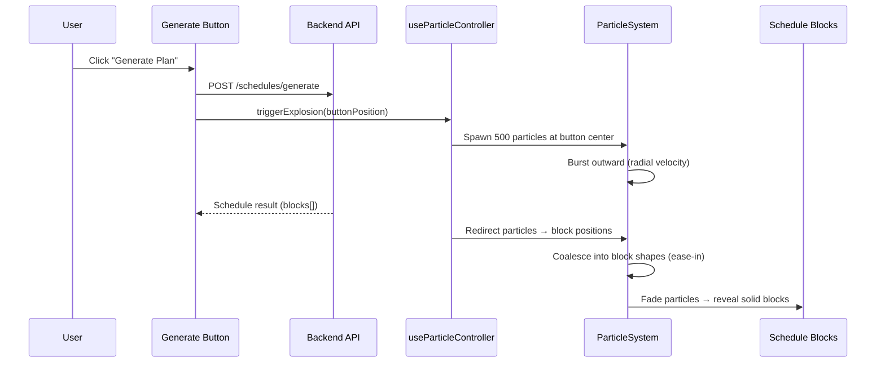
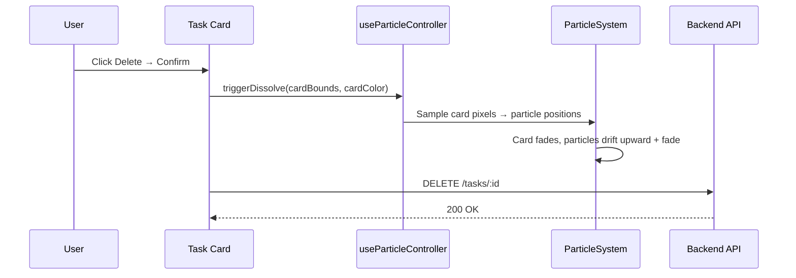

# Design Document: Three.js Cinematic 3D Animations

## Overview

This feature transforms the Cog Life Scheduler from a standard 2D web application into a cinematic, immersive 3D experience that showcases the absolute pinnacle of modern web technology. The entire application will be layered on top of a persistent Three.js canvas rendering an animated 3D environment with time-of-day ambient lighting, floating geometric shapes, particle systems, and parallax mouse tracking. Navigation between views (Today, Week, Tasks, Settings) triggers cinematic camera fly-throughs in 3D space, while schedule data is visualized as glowing 3D holographic bars in a Minority Report-style display. Every interaction — generating schedules, deleting items, receiving AI chat messages — is accompanied by explosive particle effects. All UI panels sit atop the 3D scene with frosted glassmorphism blur, and the app boots with a dramatic particle-assembly logo animation.

The implementation uses `@react-three/fiber` as the React renderer for Three.js, `@react-three/drei` for high-level helpers (Float, Stars, OrbitControls, etc.), `@react-three/postprocessing` for bloom and chromatic aberration effects, and `framer-motion` for 2D content transitions layered on top. All Three.js components are dynamically imported via `next/dynamic` with `ssr: false` to avoid SSR hydration issues in Next.js 15. The existing plain CSS design system is extended with glassmorphism tokens and CSS `backdrop-filter` blur. A gradient mesh shader runs behind the 3D scene, morphing colors based on the current time of day.

The architecture follows a layered compositing model: Gradient Mesh (layer 0) → Three.js Canvas (layer 1) → Glassmorphism UI (layer 2) → Framer Motion transitions (layer 3). Each layer is independently rendered and composited via CSS stacking contexts, ensuring the 3D scene never blocks UI interaction and the UI remains accessible despite the visual complexity.

## Architecture



## Sequence Diagrams

### App Boot — Cinematic Loading Screen



### Page Navigation — Cinematic Camera Fly-Through



### Schedule Generation — Particle Explosion



### Item Deletion — Particle Dissolution



## Components and Interfaces

### Component 1: SceneCanvas (Persistent 3D Background)

**Purpose**: Root Three.js canvas that persists across all page navigations, rendering the ambient 3D environment.

```typescript
interface SceneCanvasProps {
  currentRoute: string;
  mousePosition: { x: number; y: number };
  timeOfDay: TimeOfDay;
  particleEvents: ParticleEvent[];
  children?: React.ReactNode;
}

type TimeOfDay = 'morning' | 'afternoon' | 'evening' | 'night';

interface TimeOfDayPalette {
  ambient: THREE.Color;
  directional: THREE.Color;
  fog: THREE.Color;
  intensity: number;
  skyGradient: [string, string, string];
}
```

**Responsibilities**:
- Mount a single `<Canvas>` element that spans the full viewport behind all UI
- Manage the scene graph: floating geometries, star field, lighting rig
- Apply post-processing effects (bloom, chromatic aberration, vignette)
- React to `mousePosition` for parallax camera offset
- Transition lighting palette based on `timeOfDay`

### Component 2: CinematicCamera

**Purpose**: Spring-physics camera rig that flies through 3D space during page transitions.

```typescript
interface CinematicCameraProps {
  targetPosition: [number, number, number];
  targetLookAt: [number, number, number];
  parallaxOffset: { x: number; y: number };
  springConfig: { stiffness: number; damping: number; mass: number };
}

const PAGE_CAMERA_POSITIONS: Record<string, {
  position: [number, number, number];
  lookAt: [number, number, number];
}> = {
  '/':         { position: [0, 0, 20],  lookAt: [0, 0, 0] },
  '/week':     { position: [15, 5, -10], lookAt: [15, 0, -15] },
  '/tasks':    { position: [-10, 8, 5],  lookAt: [-10, 0, 0] },
  '/settings': { position: [0, -5, 30],  lookAt: [0, -5, 25] },
};
```

**Responsibilities**:
- Interpolate camera position/rotation using spring physics (`@react-spring/three`)
- Apply mouse parallax as additive offset to camera position
- Expose imperative `flyTo(position, lookAt)` method for programmatic control

### Component 3: FloatingGeometries

**Purpose**: Ambient floating 3D shapes that populate the background scene.

```typescript
interface FloatingGeometry {
  id: string;
  type: 'icosahedron' | 'octahedron' | 'torus' | 'torusKnot' | 'dodecahedron';
  position: [number, number, number];
  rotation: [number, number, number];
  scale: number;
  color: string;
  speed: number;
  floatIntensity: number;
  opacity: number;
}

interface FloatingGeometriesProps {
  count: number;
  spread: number;
  timeOfDay: TimeOfDay;
}
```

**Responsibilities**:
- Procedurally generate `count` geometries distributed within `spread` radius
- Each geometry uses `<Float>` from drei for gentle bobbing animation
- Wireframe or translucent material with emissive glow matching time-of-day palette
- Slowly rotate on all axes at individual speeds

### Component 4: ParticleSystem

**Purpose**: Manages all particle effects — explosions, dissolutions, sparkle trails, and logo assembly.

```typescript
type ParticleEventType = 'explosion' | 'dissolution' | 'sparkle' | 'logoAssembly';

interface ParticleEvent {
  id: string;
  type: ParticleEventType;
  origin: { x: number; y: number; z: number };
  color: string;
  count: number;
  targetPositions?: { x: number; y: number; z: number }[];
  duration: number;
  timestamp: number;
}

interface ParticleSystemProps {
  events: ParticleEvent[];
  onEventComplete: (eventId: string) => void;
}

interface Particle {
  position: THREE.Vector3;
  velocity: THREE.Vector3;
  acceleration: THREE.Vector3;
  color: THREE.Color;
  size: number;
  life: number;
  maxLife: number;
  targetPosition?: THREE.Vector3;
  phase: 'burst' | 'coalesce' | 'dissolve' | 'sparkle';
}
```

**Responsibilities**:
- Maintain a GPU-instanced particle buffer (InstancedMesh or Points with BufferGeometry)
- Process `ParticleEvent` queue: spawn particles, apply physics, handle lifecycle
- Explosion: radial burst from origin, optional coalesce to target positions
- Dissolution: sample source element bounds, drift particles upward with gravity
- Sparkle: trail particles along a path with randomized offsets and twinkle
- Logo assembly: converge random particles to predefined letter vertex positions

### Component 5: ScheduleVisualization3D

**Purpose**: 3D bar chart visualization of the week schedule in Minority Report holographic style.

```typescript
interface ScheduleVisualization3DProps {
  blocksByDate: Map<string, ScheduleBlock[]>;
  dates: string[];
  onBlockSelect: (block: ScheduleBlock) => void;
  active: boolean;
}

interface ScheduleBar3D {
  blockId: string;
  dayIndex: number;
  startHour: number;
  endHour: number;
  height: number;
  color: string;
  emissiveColor: string;
  emissiveIntensity: number;
  title: string;
}
```

**Responsibilities**:
- Render schedule blocks as 3D bars on a 7-column × 18-row time grid
- Each bar glows with its category color using emissive material
- Provide OrbitControls for user rotation/zoom
- Hover highlights bar with increased emissive intensity + tooltip
- Click selects block and triggers callback
- Grid lines rendered as thin wireframe planes with subtle glow

### Component 6: CinematicLoader

**Purpose**: Dramatic loading screen with particle-assembly logo animation.

```typescript
interface CinematicLoaderProps {
  onComplete: () => void;
  duration?: number;
}

interface LogoLetterData {
  letter: string;
  vertices: THREE.Vector3[];
  particleCount: number;
}
```

**Responsibilities**:
- Render fullscreen R3F canvas with dark background
- Generate target positions for "COG" text using TextGeometry or font sampling
- Spawn 2000+ particles at random positions
- Phase 1 (0-2s): Particles converge to letter positions with spring physics
- Phase 2 (2-3s): Hold assembled logo, subtle glow pulse
- Phase 3 (3-3.5s): Particles explode outward, fade to transparent
- Call `onComplete` to trigger app reveal

### Component 7: GlassmorphismPanel

**Purpose**: Reusable wrapper that applies frosted glass effect to any UI panel.

```typescript
interface GlassmorphismPanelProps {
  children: React.ReactNode;
  className?: string;
  blur?: number;
  opacity?: number;
  borderOpacity?: number;
  style?: React.CSSProperties;
}
```

**Responsibilities**:
- Apply `backdrop-filter: blur(${blur}px)` with semi-transparent background
- Subtle border with `rgba` transparency for glass edge effect
- Support both light and dark themes with appropriate opacity values
- Composable with existing component classes

### Component 8: GradientMeshBackground

**Purpose**: Animated gradient mesh that morphs colors based on time of day, rendered behind the 3D scene.

```typescript
interface GradientMeshBackgroundProps {
  timeOfDay: TimeOfDay;
  animationSpeed?: number;
}

const TIME_GRADIENTS: Record<TimeOfDay, {
  colors: [string, string, string, string];
  positions: [number, number][];
}> = {
  morning:   { colors: ['#FF9A56', '#FFD194', '#FFF3E0', '#FFE0B2'], positions: [[0,0],[1,0],[0,1],[1,1]] },
  afternoon: { colors: ['#4FC3F7', '#81D4FA', '#B3E5FC', '#E1F5FE'], positions: [[0,0],[1,0],[0,1],[1,1]] },
  evening:   { colors: ['#CE93D8', '#F48FB1', '#FFAB91', '#FFE082'], positions: [[0,0],[1,0],[0,1],[1,1]] },
  night:     { colors: ['#1A237E', '#283593', '#0D47A1', '#1B1B3A'], positions: [[0,0],[1,0],[0,1],[1,1]] },
};
```

**Responsibilities**:
- Render a full-viewport `<canvas>` element at z-index 0
- Animate 4+ color control points using sinusoidal motion
- Smoothly interpolate between time-of-day palettes over 30-60 seconds
- Use requestAnimationFrame for smooth 60fps rendering
- Minimal GPU impact (simple fragment shader or 2D canvas gradient)

### Component 9: FloatingCard3D

**Purpose**: Task/assignment cards with 3D perspective transforms and hover rotation.

```typescript
interface FloatingCard3DProps {
  children: React.ReactNode;
  className?: string;
  depth?: number;
  rotateIntensity?: number;
  floatAmplitude?: number;
  floatSpeed?: number;
}
```

**Responsibilities**:
- Apply CSS `perspective` and `transform-style: preserve-3d` to card container
- Track mouse position relative to card center
- On hover: rotate card on X/Y axes proportional to mouse offset (max ±15°)
- Subtle continuous float animation using CSS keyframes
- Glassmorphism background with depth shadow that shifts with rotation
- Smooth spring-based return to neutral on mouse leave

## Data Models

### TimeOfDay Configuration

```typescript
interface TimeOfDayConfig {
  morning:   { start: number; end: number }; // 6-12
  afternoon: { start: number; end: number }; // 12-17
  evening:   { start: number; end: number }; // 17-21
  night:     { start: number; end: number }; // 21-6
}

interface LightingState {
  ambientColor: string;
  ambientIntensity: number;
  directionalColor: string;
  directionalIntensity: number;
  directionalPosition: [number, number, number];
  fogColor: string;
  fogNear: number;
  fogFar: number;
  starOpacity: number;
}

const LIGHTING_PRESETS: Record<TimeOfDay, LightingState> = {
  morning: {
    ambientColor: '#FFF8E1',
    ambientIntensity: 0.6,
    directionalColor: '#FFD54F',
    directionalIntensity: 1.2,
    directionalPosition: [-5, 10, 5],
    fogColor: '#FFF3E0',
    fogNear: 20,
    fogFar: 80,
    starOpacity: 0,
  },
  afternoon: {
    ambientColor: '#E3F2FD',
    ambientIntensity: 0.8,
    directionalColor: '#90CAF9',
    directionalIntensity: 1.0,
    directionalPosition: [0, 15, 0],
    fogColor: '#BBDEFB',
    fogNear: 25,
    fogFar: 100,
    starOpacity: 0,
  },
  evening: {
    ambientColor: '#F3E5F5',
    ambientIntensity: 0.5,
    directionalColor: '#CE93D8',
    directionalIntensity: 0.8,
    directionalPosition: [10, 5, -5],
    fogColor: '#E1BEE7',
    fogNear: 15,
    fogFar: 70,
    starOpacity: 0.3,
  },
  night: {
    ambientColor: '#1A237E',
    ambientIntensity: 0.2,
    directionalColor: '#5C6BC0',
    directionalIntensity: 0.3,
    directionalPosition: [0, 10, 10],
    fogColor: '#0D1B2A',
    fogNear: 10,
    fogFar: 60,
    starOpacity: 1.0,
  },
};
```

**Validation Rules**:
- `ambientIntensity` and `directionalIntensity` must be in range [0, 2]
- `fogNear` must be less than `fogFar`
- `starOpacity` must be in range [0, 1]
- Color values must be valid hex strings

### Particle Configuration

```typescript
interface ParticleConfig {
  maxParticles: number;          // GPU buffer size (default: 10000)
  defaultSize: number;           // Base particle size (default: 0.05)
  gravity: THREE.Vector3;        // World gravity (default: [0, -0.5, 0])
  damping: number;               // Velocity damping per frame (default: 0.98)
  fadeSpeed: number;             // Life drain per second (default: 1.0)
}

interface ExplosionConfig {
  particleCount: number;         // Particles per explosion (default: 500)
  initialSpeed: number;          // Radial burst speed (default: 5.0)
  spread: number;                // Angular spread in radians (default: Math.PI * 2)
  coalesceDelay: number;         // Seconds before coalescing (default: 0.5)
  coalesceDuration: number;      // Seconds to reach targets (default: 1.0)
  coalesceEasing: string;        // Easing function name (default: 'easeInOutCubic')
}

interface DissolutionConfig {
  particleCount: number;         // Particles per dissolution (default: 300)
  driftSpeed: number;            // Upward drift speed (default: 1.0)
  turbulence: number;            // Random horizontal force (default: 0.3)
  fadeDelay: number;             // Seconds before fade starts (default: 0.3)
}

interface SparkleConfig {
  particleCount: number;         // Particles per sparkle trail (default: 50)
  trailLength: number;           // Trail persistence in seconds (default: 0.8)
  twinkleFrequency: number;      // Opacity oscillation Hz (default: 3.0)
  offsetRadius: number;          // Random offset from path (default: 0.1)
}
```

**Validation Rules**:
- `maxParticles` must be positive integer, max 50000
- `damping` must be in range (0, 1]
- `fadeSpeed` must be positive
- All `particleCount` values must be positive integers


## Algorithmic Pseudocode

### Time-of-Day Detection and Lighting Transition

```typescript
function computeTimeOfDay(date: Date): TimeOfDay {
  const hour = date.getHours();
  if (hour >= 6 && hour < 12) return 'morning';
  if (hour >= 12 && hour < 17) return 'afternoon';
  if (hour >= 17 && hour < 21) return 'evening';
  return 'night';
}

function interpolateLighting(
  current: LightingState,
  target: LightingState,
  progress: number // 0..1
): LightingState {
  // PRECONDITION: 0 <= progress <= 1
  // POSTCONDITION: result is a valid LightingState with all values
  //   linearly interpolated between current and target
  return {
    ambientColor: lerpColor(current.ambientColor, target.ambientColor, progress),
    ambientIntensity: lerp(current.ambientIntensity, target.ambientIntensity, progress),
    directionalColor: lerpColor(current.directionalColor, target.directionalColor, progress),
    directionalIntensity: lerp(current.directionalIntensity, target.directionalIntensity, progress),
    directionalPosition: lerpVec3(current.directionalPosition, target.directionalPosition, progress),
    fogColor: lerpColor(current.fogColor, target.fogColor, progress),
    fogNear: lerp(current.fogNear, target.fogNear, progress),
    fogFar: lerp(current.fogFar, target.fogFar, progress),
    starOpacity: lerp(current.starOpacity, target.starOpacity, progress),
  };
}
```

**Preconditions:**
- `date` is a valid Date object
- `progress` is a number in range [0, 1]

**Postconditions:**
- Returns a valid `TimeOfDay` enum value
- Interpolated lighting state has all numeric values between current and target
- Color interpolation produces valid hex color strings

**Loop Invariants:** N/A (no loops)

### Cinematic Camera Spring Animation

```typescript
function updateCameraSpring(
  currentPos: Vector3,
  currentVel: Vector3,
  targetPos: Vector3,
  config: { stiffness: number; damping: number; mass: number },
  deltaTime: number
): { position: Vector3; velocity: Vector3 } {
  // PRECONDITION: deltaTime > 0, config.mass > 0
  // Spring force: F = -k * (x - target) - c * v
  const displacement = currentPos.clone().sub(targetPos);
  const springForce = displacement.multiplyScalar(-config.stiffness);
  const dampingForce = currentVel.clone().multiplyScalar(-config.damping);
  const totalForce = springForce.add(dampingForce);
  const acceleration = totalForce.divideScalar(config.mass);

  const newVelocity = currentVel.clone().add(acceleration.multiplyScalar(deltaTime));
  const newPosition = currentPos.clone().add(newVelocity.clone().multiplyScalar(deltaTime));

  // POSTCONDITION: position converges to targetPos as t → ∞
  //   when damping² ≥ 4 * stiffness * mass (overdamped or critically damped)
  return { position: newPosition, velocity: newVelocity };
}
```

**Preconditions:**
- `deltaTime` is positive (typically 1/60 for 60fps)
- `config.mass` is positive
- `config.stiffness` and `config.damping` are non-negative

**Postconditions:**
- Camera position moves toward `targetPos`
- With sufficient damping, no oscillation overshoot
- Velocity approaches zero as position approaches target

**Loop Invariants:** N/A (called per frame, not looped internally)

### Particle Lifecycle Management

```typescript
function updateParticles(
  particles: Particle[],
  deltaTime: number,
  config: ParticleConfig
): Particle[] {
  // PRECONDITION: deltaTime > 0, particles.length <= config.maxParticles
  // LOOP INVARIANT: all surviving particles have life > 0

  const surviving: Particle[] = [];

  for (const p of particles) {
    // Apply forces based on phase
    switch (p.phase) {
      case 'burst':
        p.velocity.add(config.gravity.clone().multiplyScalar(deltaTime));
        p.velocity.multiplyScalar(config.damping);
        break;

      case 'coalesce':
        if (p.targetPosition) {
          const toTarget = p.targetPosition.clone().sub(p.position);
          const attractForce = toTarget.multiplyScalar(3.0); // attraction strength
          p.velocity.add(attractForce.multiplyScalar(deltaTime));
          p.velocity.multiplyScalar(0.95); // heavy damping for smooth arrival
        }
        break;

      case 'dissolve':
        p.velocity.y += config.gravity.y * -0.5 * deltaTime; // drift upward
        p.velocity.x += (Math.random() - 0.5) * 0.1; // turbulence
        p.velocity.multiplyScalar(config.damping);
        break;

      case 'sparkle':
        p.size = p.size * (0.8 + 0.4 * Math.sin(p.life * 20)); // twinkle
        p.velocity.multiplyScalar(0.99);
        break;
    }

    // Integrate position
    p.position.add(p.velocity.clone().multiplyScalar(deltaTime));

    // Drain life
    p.life -= config.fadeSpeed * deltaTime;

    // LOOP INVARIANT CHECK: only keep alive particles
    if (p.life > 0) {
      surviving.push(p);
    }
  }

  // POSTCONDITION: surviving.length <= particles.length
  // POSTCONDITION: all particles in surviving have life > 0
  return surviving;
}
```

**Preconditions:**
- `deltaTime` is positive
- `particles` array length does not exceed `config.maxParticles`
- Each particle has valid `position`, `velocity`, `life`, and `phase`

**Postconditions:**
- All returned particles have `life > 0`
- Returned array length ≤ input array length
- Particle positions have been integrated by one timestep

**Loop Invariants:**
- All particles processed so far and added to `surviving` have `life > 0`
- No particle is processed more than once

### Logo Assembly — Particle Convergence

```typescript
function generateLogoTargetPositions(
  text: string,
  fontSize: number,
  particlesPerLetter: number
): Vector3[] {
  // PRECONDITION: text.length > 0, fontSize > 0, particlesPerLetter > 0
  // Uses TextGeometry to sample surface points of each letter

  const positions: Vector3[] = [];
  let xOffset = 0;

  for (const char of text) {
    const geometry = new TextGeometry(char, {
      font: loadedFont,
      size: fontSize,
      height: fontSize * 0.2,
    });
    geometry.computeBoundingBox();
    const bbox = geometry.getBoundingBox()!;

    // Sample random points on the geometry surface
    for (let i = 0; i < particlesPerLetter; i++) {
      const point = sampleRandomSurfacePoint(geometry);
      point.x += xOffset;
      positions.push(point);
    }

    xOffset += bbox.max.x - bbox.min.x + fontSize * 0.1; // letter spacing
  }

  // Center all positions around origin
  const center = computeCentroid(positions);
  for (const p of positions) {
    p.sub(center);
  }

  // POSTCONDITION: positions.length === text.length * particlesPerLetter
  // POSTCONDITION: centroid of all positions ≈ (0, 0, 0)
  return positions;
}
```

**Preconditions:**
- `text` is a non-empty string
- `fontSize` is positive
- `particlesPerLetter` is a positive integer
- Font is loaded and available

**Postconditions:**
- Returns exactly `text.length * particlesPerLetter` positions
- All positions are centered around the origin
- Positions lie on the surface of the text geometry

**Loop Invariants:**
- `xOffset` accumulates the total width of all processed letters
- `positions.length` equals `processedLetters * particlesPerLetter`

### 3D Schedule Bar Generation

```typescript
function generateScheduleBars(
  blocksByDate: Map<string, ScheduleBlock[]>,
  dates: string[],
  gridConfig: { dayWidth: number; hourHeight: number; startHour: number; barDepth: number }
): ScheduleBar3D[] {
  // PRECONDITION: dates.length === 7, gridConfig values are positive
  const bars: ScheduleBar3D[] = [];
  const SOURCE_COLORS: Record<SourceType, { color: string; emissive: string }> = {
    fixed_event:   { color: '#6366f1', emissive: '#4338ca' },
    flexible_task: { color: '#10b981', emissive: '#059669' },
    assignment:    { color: '#f59e0b', emissive: '#d97706' },
    travel_buffer: { color: '#94a3b8', emissive: '#64748b' },
  };

  for (let dayIndex = 0; dayIndex < dates.length; dayIndex++) {
    const blocks = blocksByDate.get(dates[dayIndex]) ?? [];

    for (const block of blocks) {
      const startMin = timeToMinutes(block.startTime);
      const endMin = timeToMinutes(block.endTime);
      const startHourOffset = (startMin - gridConfig.startHour * 60) / 60;
      const durationHours = (endMin - startMin) / 60;
      const colors = SOURCE_COLORS[block.sourceType];

      bars.push({
        blockId: block.id,
        dayIndex,
        startHour: startHourOffset,
        endHour: startHourOffset + durationHours,
        height: durationHours * gridConfig.hourHeight,
        color: colors.color,
        emissiveColor: colors.emissive,
        emissiveIntensity: 0.4,
        title: block.title,
      });
    }
  }

  // POSTCONDITION: bars.length === total blocks across all dates
  // POSTCONDITION: each bar.height > 0
  return bars;
}
```

**Preconditions:**
- `dates` has exactly 7 entries
- All grid config values are positive numbers
- Block `startTime` and `endTime` are valid HH:mm strings
- `startTime` < `endTime` for each block

**Postconditions:**
- Returns one `ScheduleBar3D` per input block
- All bar heights are positive
- Day indices are in range [0, 6]

**Loop Invariants:**
- `dayIndex` is in range [0, dates.length)
- All bars generated so far have valid positive heights

### Mouse Parallax Calculation

```typescript
function computeParallaxOffset(
  mouseX: number, // normalized -1 to 1
  mouseY: number, // normalized -1 to 1
  intensity: number,
  smoothing: number,
  previousOffset: { x: number; y: number }
): { x: number; y: number } {
  // PRECONDITION: -1 <= mouseX <= 1, -1 <= mouseY <= 1
  // PRECONDITION: 0 < smoothing <= 1
  const targetX = mouseX * intensity;
  const targetY = mouseY * intensity;

  // Exponential smoothing for buttery feel
  const x = previousOffset.x + (targetX - previousOffset.x) * smoothing;
  const y = previousOffset.y + (targetY - previousOffset.y) * smoothing;

  // POSTCONDITION: |x| <= intensity, |y| <= intensity
  // POSTCONDITION: offset converges to target as frames progress
  return { x, y };
}
```

**Preconditions:**
- Mouse coordinates are normalized to [-1, 1]
- `intensity` is positive (typically 0.5-2.0)
- `smoothing` is in range (0, 1] (lower = smoother/slower)

**Postconditions:**
- Output offset magnitude never exceeds `intensity`
- Offset smoothly tracks mouse position
- With constant mouse position, offset converges to target


## Key Functions with Formal Specifications

### useTimeOfDay()

```typescript
function useTimeOfDay(updateIntervalMs: number = 60000): {
  timeOfDay: TimeOfDay;
  lighting: LightingState;
  progress: number; // 0..1 progress within current period
}
```

**Preconditions:**
- `updateIntervalMs` is a positive integer
- Component is mounted in a browser environment (access to `Date`)

**Postconditions:**
- `timeOfDay` reflects the current hour bracket
- `lighting` is the interpolated state for the current time
- `progress` is in range [0, 1] representing position within the current time period
- Hook re-evaluates every `updateIntervalMs` milliseconds

### useMouseParallax()

```typescript
function useMouseParallax(config: {
  intensity: number;
  smoothing: number;
  enabled: boolean;
}): { x: number; y: number }
```

**Preconditions:**
- `config.intensity` is positive
- `config.smoothing` is in range (0, 1]
- Component is mounted in a browser environment

**Postconditions:**
- Returns normalized offset in range [-intensity, +intensity] for both axes
- When `enabled` is false, returns `{ x: 0, y: 0 }`
- Updates on every `mousemove` event with requestAnimationFrame batching
- Respects `prefers-reduced-motion` media query (returns zero when active)

### useCinematicNavigation()

```typescript
function useCinematicNavigation(): {
  currentRoute: string;
  cameraTarget: { position: [number, number, number]; lookAt: [number, number, number] };
  isTransitioning: boolean;
  navigateTo: (route: string) => void;
}
```

**Preconditions:**
- Component is within Next.js router context
- `PAGE_CAMERA_POSITIONS` map contains entry for all valid routes

**Postconditions:**
- `cameraTarget` always corresponds to a valid route in `PAGE_CAMERA_POSITIONS`
- `isTransitioning` is true during camera animation, false when settled
- `navigateTo` triggers both camera animation and Next.js route change
- Camera animation completes before or simultaneously with page content transition

### useParticleController()

```typescript
function useParticleController(): {
  events: ParticleEvent[];
  triggerExplosion: (origin: DOMRect, color: string, targets?: DOMRect[]) => void;
  triggerDissolve: (bounds: DOMRect, color: string) => void;
  triggerSparkle: (path: { x: number; y: number }[], color: string) => void;
  clearCompleted: () => void;
}
```

**Preconditions:**
- Component is mounted in a browser environment
- DOMRect values are valid (non-negative width/height)

**Postconditions:**
- `events` array contains all active (non-completed) particle events
- `triggerExplosion` creates a new event with `type: 'explosion'` and converts DOM coordinates to 3D world coordinates
- `triggerDissolve` creates a new event with `type: 'dissolution'`
- `triggerSparkle` creates a new event with `type: 'sparkle'`
- Each event has a unique `id` and `timestamp`
- DOM-to-3D coordinate conversion accounts for camera position and projection matrix

### screenToWorld()

```typescript
function screenToWorld(
  screenX: number,
  screenY: number,
  camera: THREE.PerspectiveCamera,
  targetZ: number
): THREE.Vector3
```

**Preconditions:**
- `screenX` and `screenY` are in pixel coordinates relative to viewport
- `camera` has valid projection and view matrices
- `targetZ` is the desired depth in world space

**Postconditions:**
- Returns a world-space position that projects to (`screenX`, `screenY`) on screen at depth `targetZ`
- Accounts for camera FOV, aspect ratio, and position

## Example Usage

### Integrating SceneCanvas into Layout

```typescript
// frontend/src/app/layout.tsx — modified
import dynamic from 'next/dynamic';

const SceneCanvas = dynamic(() => import('@/components/three/SceneCanvas'), { ssr: false });
const CinematicLoader = dynamic(() => import('@/components/three/CinematicLoader'), { ssr: false });
const GradientMeshBackground = dynamic(
  () => import('@/components/three/GradientMeshBackground'), { ssr: false }
);

export default function RootLayout({ children }: { children: React.ReactNode }) {
  const [loaded, setLoaded] = useState(false);
  const { timeOfDay, lighting } = useTimeOfDay();
  const mouseOffset = useMouseParallax({ intensity: 1.5, smoothing: 0.08, enabled: true });
  const { cameraTarget, currentRoute, navigateTo } = useCinematicNavigation();
  const particleCtrl = useParticleController();

  return (
    <html lang="en">
      <body>
        {!loaded && <CinematicLoader onComplete={() => setLoaded(true)} />}
        <GradientMeshBackground timeOfDay={timeOfDay} />
        <SceneCanvas
          currentRoute={currentRoute}
          mousePosition={mouseOffset}
          timeOfDay={timeOfDay}
          particleEvents={particleCtrl.events}
        />
        <div className="app-layout glassmorphism-root">
          <Sidebar onNavigate={navigateTo} />
          <main className="main-content">
            <AnimatePresence mode="wait">
              <motion.div key={currentRoute} /* fade + scale transitions */>
                {children}
              </motion.div>
            </AnimatePresence>
          </main>
        </div>
      </body>
    </html>
  );
}
```

### Using FloatingCard3D in Tasks Page

```typescript
// frontend/src/app/tasks/page.tsx — modified
import FloatingCard3D from '@/components/three/FloatingCard3D';

// Inside the task list render:
{sortedTasks.map((task) => (
  <FloatingCard3D key={task.id} depth={40} rotateIntensity={12} floatAmplitude={3}>
    <div className="task-card glassmorphism-panel">
      <div className="task-card__header">
        <span className="task-card__title">{task.title}</span>
        <span className={`task-card__priority task-card__priority--${task.priority}`}>
          {task.priority}
        </span>
      </div>
      <div className="task-card__details">
        <span>Remaining: {formatDuration(task.remainingMinutes)}</span>
      </div>
    </div>
  </FloatingCard3D>
))}
```

### Triggering Particle Explosion on Schedule Generate

```typescript
// Inside TodayPage component:
const { triggerExplosion } = useParticleController();
const generateBtnRef = useRef<HTMLButtonElement>(null);

const handleGenerate = async () => {
  const btnRect = generateBtnRef.current?.getBoundingClientRect();
  if (btnRect) {
    triggerExplosion(btnRect, '#6366f1');
  }
  await generateSchedule();
  // After blocks arrive, trigger coalesce to block positions
};
```

### 3D Schedule Visualization Toggle in Week View

```typescript
// frontend/src/app/week/page.tsx — modified
const ScheduleVisualization3D = dynamic(
  () => import('@/components/three/ScheduleVisualization3D'),
  { ssr: false }
);

export default function WeekPage() {
  const [view3D, setView3D] = useState(false);

  return (
    <div className="gcal-page glassmorphism-panel">
      <header>
        <button onClick={() => setView3D(!view3D)}>
          {view3D ? '2D View' : '3D View'}
        </button>
      </header>

      {view3D ? (
        <ScheduleVisualization3D
          blocksByDate={blocksByDate}
          dates={weekDates}
          onBlockSelect={handleBlockClick}
          active={view3D}
        />
      ) : (
        <WeekGrid /* existing 2D grid */ />
      )}
    </div>
  );
}
```

## Correctness Properties

1. **∀ timeOfDay t, LIGHTING_PRESETS[t] produces valid LightingState**: All ambient/directional intensities are in [0, 2], fogNear < fogFar, starOpacity in [0, 1], and all color strings are valid hex.

2. **∀ particle p in updateParticles output, p.life > 0**: No dead particles survive the update cycle. The surviving array contains only particles with positive remaining life.

3. **∀ route r in PAGE_CAMERA_POSITIONS, navigateTo(r) eventually settles camera at PAGE_CAMERA_POSITIONS[r]**: The spring-based camera animation converges to the target position within a bounded time (given sufficient damping).

4. **∀ ParticleEvent e with type 'explosion', after coalesceDuration seconds, all surviving particles are within ε distance of their targetPosition**: Coalescing particles converge to their assigned targets.

5. **∀ mousePosition m where |m.x| ≤ 1 and |m.y| ≤ 1, |parallaxOffset.x| ≤ intensity and |parallaxOffset.y| ≤ intensity**: The parallax offset is always bounded by the configured intensity.

6. **∀ ScheduleBar3D bar, bar.height > 0 and 0 ≤ bar.dayIndex ≤ 6**: All generated 3D bars have positive height and valid day indices.

7. **The SceneCanvas component renders without blocking UI interaction**: The Three.js canvas is positioned behind the UI layer (lower z-index) and has `pointer-events: none` except for the 3D schedule visualization when active.

8. **∀ component C dynamically imported with `ssr: false`, C does not execute during server-side rendering**: All Three.js components are wrapped in `next/dynamic` with SSR disabled.

9. **Logo assembly produces exactly `text.length * particlesPerLetter` target positions centered at origin**: The centroid of all generated positions is approximately (0, 0, 0).

10. **Glassmorphism panels maintain text readability**: Background opacity is sufficient (≥ 0.6 in light theme, ≥ 0.7 in dark theme) to ensure WCAG AA contrast ratio for text content.

## Error Handling

### Error Scenario 1: WebGL Context Lost

**Condition**: GPU driver crash, tab backgrounded too long, or resource exhaustion causes WebGL context loss.
**Response**: Listen for `webglcontextlost` event on the canvas. Display a subtle "3D effects paused" indicator. Attempt context restoration via `webglcontextrestored` event.
**Recovery**: On context restored, reinitialize all GPU resources (textures, buffers, shaders). If restoration fails after 3 attempts, fall back to 2D-only mode by hiding the canvas and removing glassmorphism blur.

### Error Scenario 2: Three.js Dynamic Import Failure

**Condition**: Network error or chunk loading failure prevents Three.js components from loading.
**Response**: `next/dynamic` loading fallback renders a simple CSS gradient background. The app remains fully functional without 3D effects.
**Recovery**: Retry import on next navigation. Display a non-blocking toast: "3D effects unavailable — using simplified view."

### Error Scenario 3: Performance Degradation (Low FPS)

**Condition**: Device GPU cannot maintain 30fps with full effects.
**Response**: Monitor frame rate via `THREE.Clock` or `requestAnimationFrame` timing. If average FPS drops below 30 for 3 consecutive seconds, progressively reduce quality.
**Recovery**: Quality reduction cascade: (1) Disable post-processing effects, (2) Reduce particle count by 50%, (3) Reduce floating geometry count, (4) Disable parallax, (5) Fall back to static background. Store quality level in localStorage to skip degradation on next visit.

### Error Scenario 4: Reduced Motion Preference

**Condition**: User has `prefers-reduced-motion: reduce` enabled in OS settings.
**Response**: Disable all animations: no floating geometries, no particle effects, no camera fly-throughs, no parallax. Show static 3D scene or fall back to gradient background. Page transitions use instant cuts instead of animations.
**Recovery**: If user changes preference, re-enable animations on next page load.

### Error Scenario 5: Mobile/Touch Device

**Condition**: Device has no mouse (touch-only), limited GPU, small viewport.
**Response**: Disable mouse parallax. Reduce particle counts by 75%. Simplify floating geometries (fewer, simpler shapes). Disable post-processing. Use CSS-only glassmorphism without 3D canvas on devices with < 4GB RAM or no WebGL2 support.
**Recovery**: N/A — detection happens once on mount.

## Testing Strategy

### Unit Testing Approach

- Test `computeTimeOfDay()` with boundary hours (6, 12, 17, 21, 0, 5)
- Test `interpolateLighting()` with progress=0 (returns current), progress=1 (returns target), progress=0.5 (midpoint)
- Test `computeParallaxOffset()` with edge cases: mouse at corners, zero intensity, smoothing=1
- Test `generateScheduleBars()` with empty blocks, single block, overlapping blocks, all source types
- Test `screenToWorld()` coordinate conversion with known camera configurations
- Test `generateLogoTargetPositions()` produces correct count and centered positions

**Property-Based Testing Approach**:

**Property Test Library**: fast-check

- For any valid `TimeOfDay`, `LIGHTING_PRESETS` returns a state where `fogNear < fogFar`
- For any particle array, `updateParticles` output length ≤ input length
- For any mouse position in [-1, 1], parallax offset magnitude ≤ intensity
- For any set of schedule blocks, `generateScheduleBars` produces bars with positive heights
- For any spring config with positive stiffness/damping/mass, camera position converges (distance to target decreases over sufficient frames)

### Integration Testing Approach

- Verify `SceneCanvas` mounts without errors and creates a WebGL context
- Verify dynamic imports with `ssr: false` do not execute during SSR (check `typeof window`)
- Verify `CinematicLoader` calls `onComplete` after animation duration
- Verify glassmorphism CSS properties are applied correctly (backdrop-filter support detection)
- Verify `AnimatePresence` correctly unmounts previous page before mounting new page
- Verify 3D schedule visualization renders correct number of bars matching input blocks

## Performance Considerations

- **GPU Budget**: Target 60fps on mid-range GPUs (GTX 1060 / M1 equivalent). Budget: ≤ 500 draw calls, ≤ 100K triangles, ≤ 10K particles active simultaneously.
- **Instanced Rendering**: All particles use `THREE.InstancedMesh` or `THREE.Points` with `BufferGeometry` to minimize draw calls. Floating geometries use instancing where possible.
- **Post-Processing**: Bloom uses half-resolution render target. Chromatic aberration is a single full-screen pass. Vignette is a simple shader overlay.
- **Lazy Loading**: All Three.js components are code-split via `next/dynamic`. The Three.js bundle (~500KB gzipped) loads after initial HTML/CSS paint.
- **Adaptive Quality**: Runtime FPS monitoring with progressive quality reduction (see Error Handling). Quality settings persisted in localStorage.
- **Memory Management**: Dispose all Three.js geometries, materials, and textures on component unmount. Use `useEffect` cleanup functions rigorously.
- **RAF Management**: Single `requestAnimationFrame` loop managed by R3F's internal scheduler. No competing animation loops.
- **Gradient Mesh**: Uses a simple 2D canvas with 4-point gradient interpolation — negligible GPU cost compared to the 3D scene.

## Security Considerations

- **No User-Controlled Shaders**: All GLSL shaders are hardcoded. No user input is passed to shader compilation to prevent shader injection.
- **Dynamic Import Integrity**: Three.js chunks are served from the same origin with Next.js content hashing. No external CDN for Three.js to prevent supply chain attacks.
- **WebGL Fingerprinting**: The app does not expose WebGL renderer info to external services. GPU capability detection is used only for internal quality adaptation.
- **Content Security Policy**: Ensure CSP headers allow `blob:` and `data:` URIs needed by Three.js for texture loading and font data.

## Dependencies

| Package | Version | Purpose |
|---------|---------|---------|
| `three` | ^0.170.0 | Three.js core 3D engine |
| `@react-three/fiber` | ^9.0.0 | React reconciler for Three.js |
| `@react-three/drei` | ^9.120.0 | High-level R3F helpers (Float, Stars, OrbitControls, Text3D, etc.) |
| `@react-three/postprocessing` | ^3.0.0 | Post-processing effects (Bloom, ChromaticAberration, Vignette) |
| `framer-motion` | ^12.0.0 | 2D animation library for page transitions and UI animations |
| `@react-spring/three` | ^9.7.0 | Spring-physics animations for Three.js objects (camera, positions) |
| `three-stdlib` | ^2.30.0 | Additional Three.js utilities (TextGeometry, FontLoader) |
